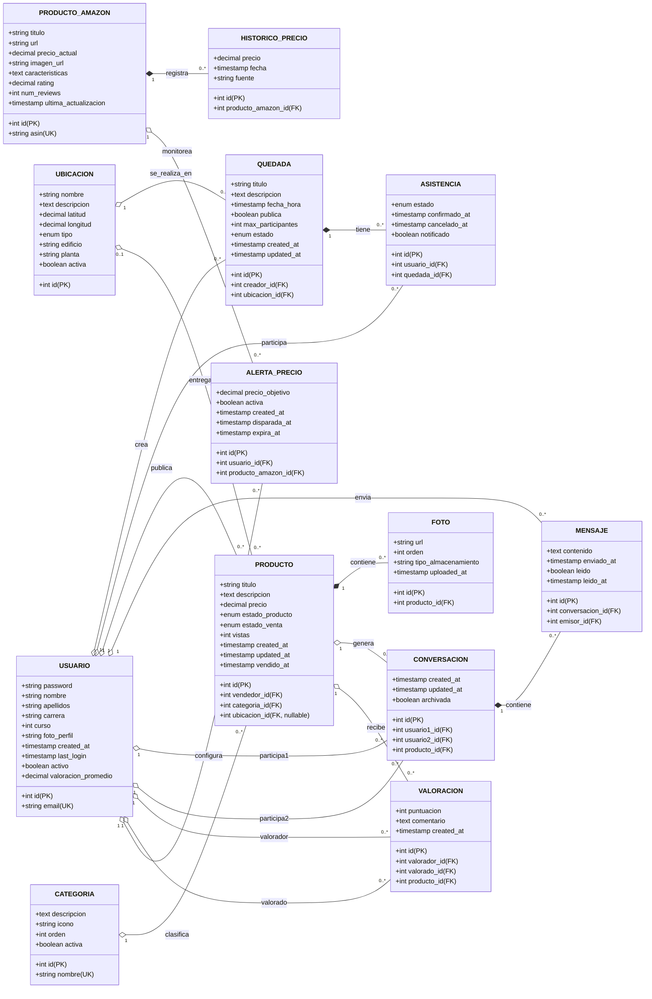

# 🗂️ Modelo de Datos - UFV Shares

## Diagrama Entidad-Relación



---

## Descripción Detallada de Entidades

### 1. USUARIO

Representa a los estudiantes registrados en la plataforma UFV Shares.

#### Atributos

| Atributo | Tipo | Restricciones | Descripción |
|----------|------|---------------|-------------|
| `id` | INT | PK, AUTO_INCREMENT | Identificador único |
| `email` | VARCHAR(255) | UNIQUE, NOT NULL | Email universitario (@ufv.es) |
| `password` | VARCHAR(255) | NOT NULL | Hash BCrypt de la contraseña |
| `nombre` | VARCHAR(100) | NOT NULL | Nombre del estudiante |
| `apellidos` | VARCHAR(150) | NOT NULL | Apellidos del estudiante |
| `carrera` | VARCHAR(100) | NOT NULL | Carrera que cursa |
| `curso` | INT | CHECK (curso BETWEEN 1 AND 4) | Curso académico (1-4) |
| `foto_perfil` | VARCHAR(500) | NULL | URL de la foto de perfil |
| `created_at` | TIMESTAMP | DEFAULT CURRENT_TIMESTAMP | Fecha de registro |
| `last_login` | TIMESTAMP | NULL | Último inicio de sesión |
| `activo` | BOOLEAN | DEFAULT TRUE | Cuenta activa/inactiva |
| `valoracion_promedio` | DECIMAL(3,2) | DEFAULT 0.00, CHECK (>=0 AND <=5) | Valoración promedio como vendedor |

#### Relaciones
- **Crea** múltiples **QUEDADA** (1:N)
- **Participa** en múltiples **ASISTENCIA** (1:N)
- **Publica** múltiples **PRODUCTO** (1:N)
- **Configura** múltiples **ALERTA_PRECIO** (1:N)
- **Envía** múltiples **MENSAJE** (1:N)
- **Participa** en múltiples **CONVERSACION** (1:N)

#### Índices
```sql
CREATE INDEX idx_usuario_email ON USUARIO(email);
CREATE INDEX idx_usuario_carrera ON USUARIO(carrera);
CREATE INDEX idx_usuario_activo ON USUARIO(activo);
```

---

### 2. QUEDADA

Representa eventos organizados por usuarios para encuentros en el campus.

#### Atributos

| Atributo | Tipo | Restricciones | Descripción |
|----------|------|---------------|-------------|
| `id` | INT | PK, AUTO_INCREMENT | Identificador único |
| `creador_id` | INT | FK -> USUARIO(id), NOT NULL | Usuario que creó la quedada |
| `titulo` | VARCHAR(200) | NOT NULL | Título de la quedada |
| `descripcion` | TEXT | NULL | Descripción detallada |
| `fecha_hora` | TIMESTAMP | NOT NULL | Fecha y hora del evento |
| `ubicacion_id` | INT | FK -> UBICACION(id), NOT NULL | Lugar del encuentro |
| `publica` | BOOLEAN | DEFAULT TRUE | Visibilidad pública/privada |
| `max_participantes` | INT | NULL, CHECK (>= 2) | Límite de asistentes |
| `estado` | ENUM | 'PENDIENTE', 'EN_CURSO', 'FINALIZADA', 'CANCELADA' | Estado actual |
| `created_at` | TIMESTAMP | DEFAULT CURRENT_TIMESTAMP | Fecha de creación |
| `updated_at` | TIMESTAMP | ON UPDATE CURRENT_TIMESTAMP | Última modificación |

#### Relaciones
- **Creada por** un **USUARIO** (N:1)
- **Se realiza en** una **UBICACION** (N:1)
- **Tiene** múltiples **ASISTENCIA** (1:N)

#### Índices
```sql
CREATE INDEX idx_quedada_fecha ON QUEDADA(fecha_hora);
CREATE INDEX idx_quedada_creador ON QUEDADA(creador_id);
CREATE INDEX idx_quedada_estado ON QUEDADA(estado);
CREATE INDEX idx_quedada_ubicacion ON QUEDADA(ubicacion_id);
```

#### Reglas de Negocio
- La `fecha_hora` debe ser futura (validación en aplicación)
- Si `publica = FALSE`, solo invitados pueden ver
- `estado` pasa automáticamente a 'FINALIZADA' después de `fecha_hora`

---

### 3. UBICACION

Representa lugares físicos en el campus universitario.

#### Atributos

| Atributo | Tipo | Restricciones | Descripción |
|----------|------|---------------|-------------|
| `id` | INT | PK, AUTO_INCREMENT | Identificador único |
| `nombre` | VARCHAR(200) | NOT NULL | Nombre de la ubicación |
| `descripcion` | TEXT | NULL | Descripción adicional |
| `latitud` | DECIMAL(10,7) | NOT NULL | Latitud GPS |
| `longitud` | DECIMAL(10,7) | NOT NULL | Longitud GPS |
| `tipo` | ENUM | 'AULA', 'BIBLIOTECA', 'CAFETERIA', 'ZONA_VERDE', 'EDIFICIO', 'OTRO' | Tipo de ubicación |
| `edificio` | VARCHAR(100) | NULL | Nombre del edificio |
| `planta` | VARCHAR(20) | NULL | Planta del edificio |
| `activa` | BOOLEAN | DEFAULT TRUE | Ubicación activa/inactiva |

#### Relaciones
- **Alberga** múltiples **QUEDADA** (1:N)
- **Sirve para entrega** de múltiples **PRODUCTO** (1:N)

#### Índices
```sql
CREATE INDEX idx_ubicacion_tipo ON UBICACION(tipo);
CREATE INDEX idx_ubicacion_coords ON UBICACION(latitud, longitud);
CREATE INDEX idx_ubicacion_activa ON UBICACION(activa);
```

#### Datos Predefinidos
```sql
-- Ejemplos de ubicaciones precargadas
INSERT INTO UBICACION (nombre, latitud, longitud, tipo, edificio) VALUES
('Biblioteca Central', 40.4426, -3.8120, 'BIBLIOTECA', 'Edificio A'),
('Cafetería Principal', 40.4428, -3.8118, 'CAFETERIA', 'Edificio B'),
('Aula Magna', 40.4425, -3.8122, 'AULA', 'Edificio C');
```

---

### 4. ASISTENCIA

Registra la participación de usuarios en quedadas.

#### Atributos

| Atributo | Tipo | Restricciones | Descripción |
|----------|------|---------------|-------------|
| `id` | INT | PK, AUTO_INCREMENT | Identificador único |
| `usuario_id` | INT | FK -> USUARIO(id), NOT NULL | Usuario asistente |
| `quedada_id` | INT | FK -> QUEDADA(id), NOT NULL | Quedada a la que asiste |
| `estado` | ENUM | 'CONFIRMADA', 'PENDIENTE', 'CANCELADA' | Estado de asistencia |
| `confirmado_at` | TIMESTAMP | NULL | Fecha de confirmación |
| `cancelado_at` | TIMESTAMP | NULL | Fecha de cancelación |
| `notificado` | BOOLEAN | DEFAULT FALSE | Si se envió recordatorio |

#### Relaciones
- **Pertenece a** un **USUARIO** (N:1)
- **Pertenece a** una **QUEDADA** (N:1)

#### Índices
```sql
CREATE UNIQUE INDEX idx_asistencia_unique ON ASISTENCIA(usuario_id, quedada_id);
CREATE INDEX idx_asistencia_quedada ON ASISTENCIA(quedada_id);
CREATE INDEX idx_asistencia_estado ON ASISTENCIA(estado);
```

#### Reglas de Negocio
- Un usuario solo puede tener una asistencia por quedada (índice único)
- `confirmado_at` se establece cuando `estado = 'CONFIRMADA'`
- Las notificaciones se envían 30 minutos antes si `notificado = FALSE`

---

### 5. PRODUCTO

Representa artículos publicados en el marketplace estudiantil.

#### Atributos

| Atributo | Tipo | Restricciones | Descripción |
|----------|------|---------------|-------------|
| `id` | INT | PK, AUTO_INCREMENT | Identificador único |
| `vendedor_id` | INT | FK -> USUARIO(id), NOT NULL | Usuario vendedor |
| `titulo` | VARCHAR(200) | NOT NULL | Título del producto |
| `descripcion` | TEXT | NOT NULL | Descripción detallada |
| `precio` | DECIMAL(10,2) | NOT NULL, CHECK (> 0) | Precio en euros |
| `categoria_id` | INT | FK -> CATEGORIA(id), NOT NULL | Categoría del producto |
| `estado_producto` | ENUM | 'NUEVO', 'COMO_NUEVO', 'BUENO', 'ACEPTABLE' | Condición física |
| `estado_venta` | ENUM | 'DISPONIBLE', 'RESERVADO', 'VENDIDO' | Estado comercial |
| `ubicacion_id` | INT | FK -> UBICACION(id), NULL | Ubicación de entrega |
| `vistas` | INT | DEFAULT 0 | Número de visualizaciones |
| `created_at` | TIMESTAMP | DEFAULT CURRENT_TIMESTAMP | Fecha de publicación |
| `updated_at` | TIMESTAMP | ON UPDATE CURRENT_TIMESTAMP | Última modificación |
| `vendido_at` | TIMESTAMP | NULL | Fecha de venta |

#### Relaciones
- **Publicado por** un **USUARIO** (N:1)
- **Pertenece a** una **CATEGORIA** (N:1)
- **Se entrega en** una **UBICACION** (N:1, opcional)
- **Tiene** múltiples **FOTO** (1:N)
- **Genera** múltiples **CONVERSACION** (1:N)

#### Índices
```sql
CREATE INDEX idx_producto_vendedor ON PRODUCTO(vendedor_id);
CREATE INDEX idx_producto_categoria ON PRODUCTO(categoria_id);
CREATE INDEX idx_producto_estado_venta ON PRODUCTO(estado_venta);
CREATE INDEX idx_producto_precio ON PRODUCTO(precio);
CREATE INDEX idx_producto_created ON PRODUCTO(created_at DESC);
```

#### Reglas de Negocio
- Un usuario puede tener máximo 20 productos con `estado_venta = 'DISPONIBLE'`
- Las publicaciones se archivan automáticamente después de 90 días
- `vendido_at` se establece cuando `estado_venta` cambia a 'VENDIDO'

---

### 6. PRODUCTO_AMAZON

Representa productos de Amazon monitoreados para comparación de precios.

#### Atributos

| Atributo | Tipo | Restricciones | Descripción |
|----------|------|---------------|-------------|
| `id` | INT | PK, AUTO_INCREMENT | Identificador único |
| `asin` | VARCHAR(20) | UNIQUE, NOT NULL | Amazon Standard Identification Number |
| `titulo` | VARCHAR(500) | NOT NULL | Título del producto |
| `url` | VARCHAR(1000) | NOT NULL | URL completa de Amazon |
| `precio_actual` | DECIMAL(10,2) | NOT NULL | Precio actual en euros |
| `imagen_url` | VARCHAR(1000) | NULL | URL de imagen principal |
| `caracteristicas` | TEXT | NULL | Características principales (JSON) |
| `rating` | DECIMAL(3,2) | NULL, CHECK (>=0 AND <=5) | Valoración promedio |
| `num_reviews` | INT | DEFAULT 0 | Número de reseñas |
| `ultima_actualizacion` | TIMESTAMP | DEFAULT CURRENT_TIMESTAMP | Última actualización de datos |

#### Relaciones
- **Registra** múltiples **HISTORICO_PRECIO** (1:N)
- **Es monitoreado por** múltiples **ALERTA_PRECIO** (1:N)

#### Índices
```sql
CREATE UNIQUE INDEX idx_producto_amazon_asin ON PRODUCTO_AMAZON(asin);
CREATE INDEX idx_producto_amazon_updated ON PRODUCTO_AMAZON(ultima_actualizacion);
```

#### Reglas de Negocio
- Los datos se actualizan cada 6 horas vía batch job
- `asin` es el identificador único en Amazon
- Los precios se obtienen de Amazon Product Advertising API

---

### 7. HISTORICO_PRECIO

Almacena la evolución histórica de precios de productos Amazon.

#### Atributos

| Atributo | Tipo | Restricciones | Descripción |
|----------|------|---------------|-------------|
| `id` | INT | PK, AUTO_INCREMENT | Identificador único |
| `producto_amazon_id` | INT | FK -> PRODUCTO_AMAZON(id), NOT NULL | Producto asociado |
| `precio` | DECIMAL(10,2) | NOT NULL | Precio registrado |
| `fecha` | TIMESTAMP | NOT NULL | Fecha del registro |
| `fuente` | VARCHAR(50) | NOT NULL | Origen de dato ('keepa', 'amazon', 'manual') |

#### Relaciones
- **Pertenece a** un **PRODUCTO_AMAZON** (N:1)

#### Índices
```sql
CREATE INDEX idx_historico_producto ON HISTORICO_PRECIO(producto_amazon_id);
CREATE INDEX idx_historico_fecha ON HISTORICO_PRECIO(fecha DESC);
CREATE INDEX idx_historico_composite ON HISTORICO_PRECIO(producto_amazon_id, fecha DESC);
```

#### Reglas de Negocio
- Los datos históricos provienen principalmente de Keepa API
- Se almacena un registro por día mínimo
- Los datos antiguos (> 2 años) se archivan para optimizar rendimiento

---

### 8. ALERTA_PRECIO

Notificaciones configuradas por usuarios para monitorear precios Amazon.

#### Atributos

| Atributo | Tipo | Restricciones | Descripción |
|----------|------|---------------|-------------|
| `id` | INT | PK, AUTO_INCREMENT | Identificador único |
| `usuario_id` | INT | FK -> USUARIO(id), NOT NULL | Usuario que creó la alerta |
| `producto_amazon_id` | INT | FK -> PRODUCTO_AMAZON(id), NOT NULL | Producto monitoreado |
| `precio_objetivo` | DECIMAL(10,2) | NOT NULL | Precio deseado por el usuario |
| `activa` | BOOLEAN | DEFAULT TRUE | Alerta activa/inactiva |
| `created_at` | TIMESTAMP | DEFAULT CURRENT_TIMESTAMP | Fecha de creación |
| `disparada_at` | TIMESTAMP | NULL | Fecha en que se cumplió condición |
| `expira_at` | TIMESTAMP | NULL | Fecha de expiración automática |

#### Relaciones
- **Pertenece a** un **USUARIO** (N:1)
- **Monitorea** un **PRODUCTO_AMAZON** (N:1)

#### Índices
```sql
CREATE INDEX idx_alerta_usuario ON ALERTA_PRECIO(usuario_id);
CREATE INDEX idx_alerta_producto ON ALERTA_PRECIO(producto_amazon_id);
CREATE INDEX idx_alerta_activa ON ALERTA_PRECIO(activa);
```

#### Reglas de Negocio
- Un usuario puede tener máximo 10 alertas activas simultáneamente
- Las alertas se verifican cada 6 horas (cron job)
- Se desactivan automáticamente al cumplirse (`disparada_at` NOT NULL)
- Expiran automáticamente después de 90 días si no se cumplen

---

### 9. CATEGORIA

Clasificación de productos en el marketplace.

#### Atributos

| Atributo | Tipo | Restricciones | Descripción |
|----------|------|---------------|-------------|
| `id` | INT | PK, AUTO_INCREMENT | Identificador único |
| `nombre` | VARCHAR(100) | UNIQUE, NOT NULL | Nombre de la categoría |
| `descripcion` | TEXT | NULL | Descripción de la categoría |
| `icono` | VARCHAR(50) | NULL | Clase CSS del icono |
| `orden` | INT | DEFAULT 0 | Orden de visualización |
| `activa` | BOOLEAN | DEFAULT TRUE | Categoría activa/inactiva |

#### Relaciones
- **Clasifica** múltiples **PRODUCTO** (1:N)

#### Índices
```sql
CREATE INDEX idx_categoria_activa ON CATEGORIA(activa);
CREATE INDEX idx_categoria_orden ON CATEGORIA(orden);
```

#### Datos Predefinidos
```sql
INSERT INTO CATEGORIA (nombre, descripcion, icono, orden) VALUES
('Libros', 'Libros de texto y apuntes', 'fa-book', 1),
('Tecnología', 'Ordenadores, tablets, móviles', 'fa-laptop', 2),
('Muebles', 'Muebles para habitación o estudio', 'fa-couch', 3),
('Ropa', 'Ropa y accesorios', 'fa-tshirt', 4),
('Deportes', 'Material deportivo', 'fa-dumbbell', 5),
('Otros', 'Otros productos', 'fa-box', 6);
```

---

### 10. FOTO

Imágenes asociadas a productos del marketplace.

#### Atributos

| Atributo | Tipo | Restricciones | Descripción |
|----------|------|---------------|-------------|
| `id` | INT | PK, AUTO_INCREMENT | Identificador único |
| `producto_id` | INT | FK -> PRODUCTO(id), NOT NULL | Producto al que pertenece |
| `url` | VARCHAR(1000) | NOT NULL | URL de la imagen |
| `orden` | INT | DEFAULT 0 | Orden de visualización |
| `tipo_almacenamiento` | VARCHAR(20) | DEFAULT 'AWS_S3' | Servicio de almacenamiento |
| `uploaded_at` | TIMESTAMP | DEFAULT CURRENT_TIMESTAMP | Fecha de subida |

#### Relaciones
- **Pertenece a** un **PRODUCTO** (N:1)

#### Índices
```sql
CREATE INDEX idx_foto_producto ON FOTO(producto_id);
CREATE INDEX idx_foto_orden ON FOTO(producto_id, orden);
```

#### Reglas de Negocio
- Máximo 5 fotos por producto
- Formatos permitidos: JPG, PNG
- Tamaño máximo: 5MB por imagen
- La primera foto (`orden = 0`) es la portada

---

### 11. CONVERSACION

Hilos de chat entre usuarios sobre productos del marketplace.

#### Atributos

| Atributo | Tipo | Restricciones | Descripción |
|----------|------|---------------|-------------|
| `id` | INT | PK, AUTO_INCREMENT | Identificador único |
| `usuario1_id` | INT | FK -> USUARIO(id), NOT NULL | Primer participante |
| `usuario2_id` | INT | FK -> USUARIO(id), NOT NULL | Segundo participante |
| `producto_id` | INT | FK -> PRODUCTO(id), NOT NULL | Producto sobre el que se conversa |
| `created_at` | TIMESTAMP | DEFAULT CURRENT_TIMESTAMP | Fecha de inicio |
| `updated_at` | TIMESTAMP | ON UPDATE CURRENT_TIMESTAMP | Última actividad |
| `archivada` | BOOLEAN | DEFAULT FALSE | Conversación archivada |

#### Relaciones
- **Participa** **USUARIO** como usuario1 (N:1)
- **Participa** **USUARIO** como usuario2 (N:1)
- **Trata sobre** un **PRODUCTO** (N:1)
- **Contiene** múltiples **MENSAJE** (1:N)

#### Índices
```sql
CREATE INDEX idx_conversacion_usuarios ON CONVERSACION(usuario1_id, usuario2_id);
CREATE INDEX idx_conversacion_producto ON CONVERSACION(producto_id);
CREATE INDEX idx_conversacion_updated ON CONVERSACION(updated_at DESC);
```

#### Reglas de Negocio
- Una conversación es única por combinación (usuario1, usuario2, producto)
- Se archiva automáticamente después de 30 días sin actividad
- Solo los participantes pueden ver los mensajes

---

### 12. MENSAJE

Mensajes individuales dentro de conversaciones.

#### Atributos

| Atributo | Tipo | Restricciones | Descripción |
|----------|------|---------------|-------------|
| `id` | INT | PK, AUTO_INCREMENT | Identificador único |
| `conversacion_id` | INT | FK -> CONVERSACION(id), NOT NULL | Conversación a la que pertenece |
| `emisor_id` | INT | FK -> USUARIO(id), NOT NULL | Usuario que envía el mensaje |
| `contenido` | TEXT | NOT NULL | Texto del mensaje |
| `enviado_at` | TIMESTAMP | DEFAULT CURRENT_TIMESTAMP | Fecha y hora de envío |
| `leido` | BOOLEAN | DEFAULT FALSE | Si fue leído por destinatario |
| `leido_at` | TIMESTAMP | NULL | Fecha de lectura |

#### Relaciones
- **Pertenece a** una **CONVERSACION** (N:1)
- **Enviado por** un **USUARIO** (N:1)

#### Índices
```sql
CREATE INDEX idx_mensaje_conversacion ON MENSAJE(conversacion_id);
CREATE INDEX idx_mensaje_emisor ON MENSAJE(emisor_id);
CREATE INDEX idx_mensaje_enviado ON MENSAJE(enviado_at DESC);
```

#### Reglas de Negocio
- Longitud máxima: 2000 caracteres
- Los mensajes no pueden editarse después de enviados
- Se marca como leído cuando el destinatario abre la conversación

---

### 13. VALORACION

Valoraciones mutuas entre usuarios tras transacciones.

#### Atributos

| Atributo | Tipo | Restricciones | Descripción |
|----------|------|---------------|-------------|
| `id` | INT | PK, AUTO_INCREMENT | Identificador único |
| `valorador_id` | INT | FK -> USUARIO(id), NOT NULL | Usuario que valora |
| `valorado_id` | INT | FK -> USUARIO(id), NOT NULL | Usuario valorado |
| `puntuacion` | INT | NOT NULL, CHECK (>=1 AND <=5) | Estrellas (1-5) |
| `comentario` | TEXT | NULL | Comentario opcional |
| `producto_id` | INT | FK -> PRODUCTO(id), NOT NULL | Producto relacionado |
| `created_at` | TIMESTAMP | DEFAULT CURRENT_TIMESTAMP | Fecha de valoración |

#### Relaciones
- **Realizada por** un **USUARIO** (N:1)
- **Recibida por** un **USUARIO** (N:1)
- **Asociada a** un **PRODUCTO** (N:1)

#### Índices
```sql
CREATE INDEX idx_valoracion_valorado ON VALORACION(valorado_id);
CREATE UNIQUE INDEX idx_valoracion_unique ON VALORACION(valorador_id, producto_id);
```

#### Reglas de Negocio
- Un usuario solo puede valorar una vez por producto
- Solo el comprador puede valorar al vendedor
- La valoración promedio del usuario se actualiza con trigger

---

## Relaciones Complejas y Restricciones

### Integridad Referencial

```sql
-- Cascadas de eliminación
ALTER TABLE ASISTENCIA ADD CONSTRAINT fk_asistencia_quedada 
    FOREIGN KEY (quedada_id) REFERENCES QUEDADA(id) ON DELETE CASCADE;

ALTER TABLE FOTO ADD CONSTRAINT fk_foto_producto 
    FOREIGN KEY (producto_id) REFERENCES PRODUCTO(id) ON DELETE CASCADE;

-- Restricciones de protección (evitar eliminación)
ALTER TABLE QUEDADA ADD CONSTRAINT fk_quedada_creador 
    FOREIGN KEY (creador_id) REFERENCES USUARIO(id) ON DELETE RESTRICT;

ALTER TABLE PRODUCTO ADD CONSTRAINT fk_producto_vendedor 
    FOREIGN KEY (vendedor_id) REFERENCES USUARIO(id) ON DELETE RESTRICT;
```

### Triggers

#### 1. Actualizar valoración promedio de usuario
```sql
CREATE TRIGGER tr_actualizar_valoracion_usuario
AFTER INSERT ON VALORACION
FOR EACH ROW
BEGIN
    UPDATE USUARIO
    SET valoracion_promedio = (
        SELECT AVG(puntuacion)
        FROM VALORACION
        WHERE valorado_id = NEW.valorado_id
    )
    WHERE id = NEW.valorado_id;
END;
```

#### 2. Registrar precio en histórico al crear producto Amazon
```sql
CREATE TRIGGER tr_insertar_precio_inicial
AFTER INSERT ON PRODUCTO_AMAZON
FOR EACH ROW
BEGIN
    INSERT INTO HISTORICO_PRECIO (producto_amazon_id, precio, fecha, fuente)
    VALUES (NEW.id, NEW.precio_actual, NOW(), 'amazon');
END;
```

#### 3. Actualizar última actividad de conversación
```sql
CREATE TRIGGER tr_actualizar_conversacion
AFTER INSERT ON MENSAJE
FOR EACH ROW
BEGIN
    UPDATE CONVERSACION
    SET updated_at = NOW()
    WHERE id = NEW.conversacion_id;
END;
```

---

## Optimizaciones y Consideraciones

### Particionamiento

Para tablas con alto volumen de datos:

```sql
-- Particionar HISTORICO_PRECIO por rango de fechas
ALTER TABLE HISTORICO_PRECIO
PARTITION BY RANGE (YEAR(fecha)) (
    PARTITION p2024 VALUES LESS THAN (2025),
    PARTITION p2025 VALUES LESS THAN (2026),
    PARTITION p2026 VALUES LESS THAN (2027),
    PARTITION p_future VALUES LESS THAN MAXVALUE
);
```

### Cache de Consultas Frecuentes

- Productos Amazon con alto tráfico: Redis Cache (6 horas)
- Ubicaciones del campus: Cache inmutable
- Gráficas de precios: Cache por 6 horas

### Archivado de Datos Antiguos

```sql
-- Archivar quedadas finalizadas hace más de 6 meses
CREATE TABLE QUEDADA_ARCHIVO LIKE QUEDADA;

CREATE EVENT evt_archivar_quedadas
ON SCHEDULE EVERY 1 MONTH
DO
  INSERT INTO QUEDADA_ARCHIVO
  SELECT * FROM QUEDADA
  WHERE estado = 'FINALIZADA' 
    AND fecha_hora < DATE_SUB(NOW(), INTERVAL 6 MONTH);
  
  DELETE FROM QUEDADA
  WHERE estado = 'FINALIZADA' 
    AND fecha_hora < DATE_SUB(NOW(), INTERVAL 6 MONTH);
```

---

## Estimación de Volumen de Datos

| Tabla | Registros (Año 1) | Crecimiento Anual | Tamaño Estimado |
|-------|-------------------|-------------------|-----------------|
| USUARIO | 500 | +30% | 50 KB |
| QUEDADA | 2,000 | +50% | 400 KB |
| ASISTENCIA | 8,000 | +50% | 300 KB |
| PRODUCTO | 1,500 | +40% | 600 KB |
| PRODUCTO_AMAZON | 300 | +100% | 200 KB |
| HISTORICO_PRECIO | 100,000 | +200% | 5 MB |
| MENSAJE | 20,000 | +80% | 2 MB |
| **TOTAL** | - | - | **~9 MB** |

### Proyección a 5 años: ~150 MB

> La base de datos es altamente escalable y optimizada para el volumen esperado de la comunidad UFV.
