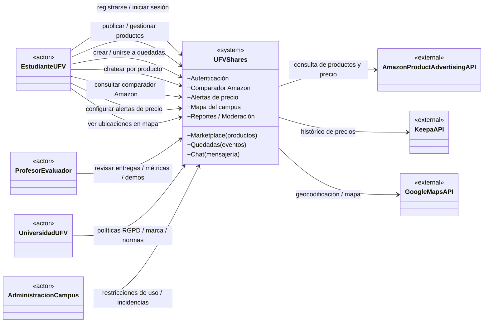

# 🔍 Análisis Externo - UFV Shares

## Contenido

1. [Identificación de Stakeholders](#identificación-de-stakeholders)
2. [Análisis de Competidores](#análisis-de-competidores)
3. [Factores del Entorno](#factores-del-entorno)
4. [Análisis PESTEL](#análisis-pestel)
5. [Análisis DAFO](#análisis-dafo)

---

## Identificación de Stakeholders

### 1. Estudiantes UFV (Usuarios Finales Principales)

#### Perfil
- **Tipo**: Stakeholder directo, usuario final
- **Cantidad estimada**: 500-1,000 estudiantes potenciales
- **Características**:
  - Edad: 18-25 años
  - Nativos digitales
  - Usuarios intensivos de smartphones
  - Interesados en ahorro económico
  - Buscan socialización y comunidad

#### Necesidades Específicas
- Coordinación de encuentros académicos y sociales
- Herramientas para ahorrar en compras de material universitario
- Plataforma segura para compraventa entre estudiantes
- Navegación fácil por el campus
- Interfaz intuitiva y rápida

#### Expectativas
- Aplicación disponible 24/7
- Información de precios confiable y actualizada
- Privacidad y seguridad de datos personales
- Respuesta rápida del sistema
- Soporte en español

#### Nivel de Influencia: **ALTO**
> Son los usuarios principales y su adopción determina el éxito del proyecto

#### Estrategia de Engagement
- Campaña de lanzamiento en campus
- Incentivos para early adopters
- Feedback constante mediante encuestas
- Soporte directo vía email/chat

---

### 2. Profesor Roberto Rodríguez Galán (Stakeholder y Evaluador)

#### Perfil
- **Tipo**: Stakeholder académico, evaluador
- **Rol**: Profesor de Proyectos 2, Stakeholder del proyecto
- **Departamento**: Escuela Politécnica Superior UFV

#### Necesidades Específicas
- Cumplimiento de requisitos académicos del curso
- Aplicación de metodologías ágiles (Scrum, Git Flow)
- Calidad técnica demostrable (tests, CI/CD)
- Documentación completa y profesional
- Despliegue funcional en producción

#### Expectativas
- Trabajo en equipo efectivo
- Entregas en sprints según calendario
- Aplicación de TDD y cobertura > 75%
- Uso de Azure DevOps para gestión
- Presentación profesional del producto final

#### Nivel de Influencia: **MUY ALTO**
> Su evaluación determina la calificación del proyecto y la aprobación de la asignatura

#### Estrategia de Engagement
- Reuniones de seguimiento cada sprint
- Demostraciones de avances (sprint reviews)
- Documentación técnica detallada
- Transparencia en métricas de calidad

---

### 3. Universidad Francisco de Vitoria

#### Perfil
- **Tipo**: Stakeholder institucional
- **Interés**: Imagen de marca, innovación, comunidad estudiantil

#### Necesidades Específicas
- Fomentar sentido de comunidad entre estudiantes
- Modernización digital del campus
- Reputación como universidad innovadora
- Seguridad y privacidad de datos de estudiantes
- Uso responsable de la imagen institucional

#### Expectativas
- Cumplimiento de normativa de protección de datos (RGPD)
- Moderación de contenido publicado
- No asociación con contenido inapropiado
- Posible expansión a otros campus en el futuro
- Uso de dominio @ufv.es validado

#### Nivel de Influencia: **MEDIO-ALTO**
> Puede autorizar o restringir el uso de la marca y el acceso a recursos del campus

#### Estrategia de Engagement
- Solicitud formal de autorización para uso de marca
- Compromiso de cumplimiento de normativa
- Reportes periódicos de uso y adopción
- Propuesta de colaboración institucional futura

---

### 4. Administración del Campus

#### Perfil
- **Tipo**: Stakeholder operativo
- **Departamento**: Servicios generales, seguridad

#### Necesidades Específicas
- Control de actividades organizadas en campus
- Seguridad de estudiantes en encuentros
- Trazabilidad de eventos para coordinación de espacios
- Prevención de mal uso de instalaciones

#### Expectativas
- Notificación de quedadas masivas (>50 personas)
- Restricciones de horarios (sin quedadas nocturnas)
- Ubicaciones permitidas claramente delimitadas
- Sistema de reporte de incidencias

#### Nivel de Influencia: **MEDIO**
> Pueden imponer restricciones de uso o regulaciones específicas

#### Estrategia de Engagement
- Reunión informativa sobre funcionalidades
- Sistema de reportes para administración
- Política de uso responsable
- Canal de comunicación para incidencias

---

### 5. Desarrolladores (Equipo de Proyecto)

#### Perfil
- **Tipo**: Stakeholders internos, ejecutores
- **Equipo**: 5 miembros (Tech Lead, PO, Dev, Scrum Master, QA)

#### Necesidades Específicas
- Especificaciones claras de requisitos
- Tecnologías modernas y documentadas
- Ambiente de desarrollo configurado
- Herramientas de CI/CD funcionales
- Tiempo suficiente para implementación de calidad

#### Expectativas
- Aprendizaje de tecnologías relevantes del mercado
- Proyecto atractivo para portafolio profesional
- Trabajo en equipo colaborativo
- Evaluación justa del desempeño individual

#### Nivel de Influencia: **ALTO**
> Su compromiso y habilidades determinan la calidad del producto final

---

### 6. Amazon / Keepa (Proveedores de APIs)

#### Perfil
- **Tipo**: Stakeholders externos, proveedores de servicios
- **Servicios**: Amazon Product Advertising API, Keepa API

#### Necesidades/Políticas
- **Amazon**: 
  - Uso de API conforme a términos de servicio
  - Partner tag válido y activo
  - No scraping directo de su web
- **Keepa**:
  - Pago de suscripción mensual (€19.90/mes)
  - Respeto de límites de peticiones

#### Expectativas
- Uso responsable de las APIs
- No reventa de datos obtenidos
- Cumplimiento de rate limits

#### Nivel de Influencia: **MEDIO**
> Pueden suspender acceso si se violan términos de servicio

#### Estrategia de Mitigación
- Lectura completa de términos de servicio
- Implementación de rate limiting
- Sistema de cache agresivo
- Monitorización de uso de cuotas

---

## Matriz de Stakeholders (Poder vs Interés)

```
           ALTO PODER
               │
    Gestionar  │  Mantener
    Cercanía   │  Satisfecho
               │
    ───────────┼───────────
               │
    Monitorear │  Mantener
               │  Informado
               │
           BAJO PODER
               │
           BAJO INTERÉS ──────> ALTO INTERÉS
```

### Posicionamiento:
- **Gestionar Cercanía**: Profesor (evaluador)
- **Mantener Satisfecho**: Universidad UFV
- **Mantener Informado**: Estudiantes, Administración
- **Monitorear**: Proveedores de APIs

---

## Diagrama UML (Contexto Externo)

Diagrama UML de **contexto externo**: muestra los actores principales (stakeholders) y cómo interactúan con el sistema **UFV Shares** y con APIs externas.



---

## Análisis de Competidores

### Competencia Directa

#### 1. No existe competencia directa
**Conclusión**: No hay plataformas que integren simultáneamente:
- Quedadas en campus universitario
- Comparador de precios Amazon
- Marketplace estudiantil
- Mapa interactivo del campus

**Ventaja**: Proposición de valor única (first mover advantage)

---

### Competencia Indirecta

#### 1. Meetup.com

**Fortalezas**:
- Reconocimiento de marca global
- Amplia base de usuarios
- Múltiples categorías de eventos
- App móvil nativa

**Debilidades**:
- No específico para universitarios
- Sin comparador de precios
- Sin marketplace
- Sin mapa de campus

**Diferenciación de UFV Shares**:
- Enfoque exclusivo en estudiantes UFV
- Integración con mapa del campus
- Funcionalidades adicionales (marketplace, comparador)

---

#### 2. CamelCamelCamel / Keepa (usuarios directos)

**Fortalezas**:
- Amplio histórico de precios Amazon
- Gráficas detalladas
- Sistema de alertas robusto
- Gratis para usuarios

**Debilidades**:
- Solo comparador de precios (monotarea)
- Interfaz anticuada
- No integrado con otras funcionalidades

**Diferenciación de UFV Shares**:
- Integración en ecosistema estudiantil
- Parte de plataforma multifuncional
- Orientado a compras universitarias

---

#### 3. Wallapop

**Fortalezas**:
- Líder en marketplace C2C en España
- App móvil excelente
- Sistema de valoraciones consolidado
- Geolocalización de vendedores

**Debilidades**:
- Audiencia general (no universitaria)
- Sin funcionalidades de quedadas
- Sin comparador de precios
- Sin enfoque en campus

**Diferenciación de UFV Shares**:
- Exclusivo para estudiantes UFV (confianza)
- Entrega en campus (sin desplazamientos)
- Integrado con otras funcionalidades

---

#### 4. Google Maps

**Fortalezas**:
- Líder absoluto en mapas
- Datos actualizados constantemente
- Navegación GPS precisa
- Información de tráfico

**Debilidades**:
- No personalizado para campus UFV
- Sin ubicaciones internas de aulas específicas
- Sin integración con quedadas
- Sobrecarga de información

**Diferenciación de UFV Shares**:
- Mapa específico del campus con ubicaciones exactas
- Integración con sistema de quedadas
- Solo información relevante para estudiantes

---

### Tabla Comparativa

| Característica | UFV Shares | Meetup | CamelCamel | Wallapop | Google Maps |
|----------------|-----------|--------|------------|----------|-------------|
| **Quedadas en campus** | ✅ | ✅ (genérico) | ❌ | ❌ | ❌ |
| **Comparador precios** | ✅ | ❌ | ✅ | ❌ | ❌ |
| **Marketplace** | ✅ | ❌ | ❌ | ✅ | ❌ |
| **Mapa campus** | ✅ | ❌ | ❌ | ❌ | ✅ (genérico) |
| **Exclusivo UFV** | ✅ | ❌ | ❌ | ❌ | ❌ |
| **Integración completa** | ✅ | ❌ | ❌ | ❌ | ❌ |
| **App móvil nativa** | ❌ | ✅ | ✅ | ✅ | ✅ |
| **Coste usuario** | Gratis | Gratis | Gratis | Gratis | Gratis |

---

### Ventaja Competitiva (Blue Ocean Strategy)

UFV Shares crea un **nuevo espacio de mercado** al combinar cuatro servicios en uno:

```
Valor = Quedadas + Comparador + Marketplace + Mapa
────────────────────────────────────────────────────
            Enfoque Campus Universitario
```

**Propuesta de Valor Única**: 
> "La única plataforma todo-en-uno diseñada específicamente para la vida universitaria en UFV"

---

## Factores del Entorno

### Análisis PESTEL

#### **P - Políticos**

| Factor | Impacto | Descripción |
|--------|---------|-------------|
| Regulación de protección de datos | ALTO | RGPD obliga a implementar medidas estrictas de privacidad |
| Políticas educativas digitales | MEDIO | Impulso gubernamental a digitalización universitaria |
| Normativas de consumo online | BAJO | Regulación de e-commerce no afecta directamente |

**Acción**: Implementar cumplimiento RGPD desde el diseño (privacy by design)

---

#### **E - Económicos**

| Factor | Impacto | Descripción |
|--------|---------|-------------|
| Crisis económica post-COVID | ALTO | Estudiantes buscan maximizar ahorro en compras |
| Inflación en material universitario | ALTO | Libros y tecnología cada vez más caros |
| Economía colaborativa en auge | ALTO | Tendencia creciente de compraventa P2P |
| Coste de APIs externas | MEDIO | Keepa €19.90/mes, límites de Amazon API |

**Oportunidad**: El contexto económico favorece herramientas de ahorro

---

#### **S - Sociales**

| Factor | Impacto | Descripción |
|--------|---------|-------------|
| Generación Z digital | ALTO | Usuarios nativos digitales, alta adopción tech |
| Necesidad de comunidad post-pandemia | ALTO | Estudiantes buscan reconexión social |
| Sostenibilidad y reutilización | MEDIO | Preferencia por productos de segunda mano |
| Cultura de reviews y valoraciones | ALTO | Confianza basada en opiniones de pares |

**Oportunidad**: Timing perfecto para herramienta de conexión estudiantil

---

#### **T - Tecnológicos**

| Factor | Impacto | Descripción |
|--------|---------|-------------|
| Penetración smartphones | ALTO | 100% de estudiantes tienen smartphone |
| APIs públicas disponibles | ALTO | Amazon, Keepa, Google Maps accesibles |
| Cloud computing (Azure) | ALTO | Infraestructura escalable y asequible |
| Frameworks modernos (Spring Boot) | ALTO | Desarrollo rápido y robusto |
| PWA (Progressive Web Apps) | MEDIO | Alternativa viable a apps nativas |

**Oportunidad**: Tecnología madura y accesible para implementación

---

#### **E - Ecológicos**

| Factor | Impacto | Descripción |
|--------|---------|-------------|
| Reutilización de productos | MEDIO | Marketplace contribuye a economía circular |
| Reducción de desplazamientos | BAJO | Entregas en campus reducen transporte |
| Conciencia ambiental estudiantes | MEDIO | Valoración positiva de iniciativas sostenibles |

**Comunicación**: Resaltar beneficio ecológico del marketplace

---

#### **L - Legales**

| Factor | Impacto | Descripción |
|--------|---------|-------------|
| RGPD (Reglamento General de Protección de Datos) | ALTO | Obligatorio cumplimiento para datos de estudiantes |
| Ley de Servicios Digitales (DSA) | MEDIO | Regulación de contenido generado por usuarios |
| Términos de servicio de APIs | ALTO | Amazon y Keepa imponen restricciones de uso |
| Propiedad intelectual (marca UFV) | MEDIO | Necesaria autorización para uso de marca |
| Ley de comercio electrónico | BAJO | Marketplace P2P tiene menos requisitos |

**Requisitos Legales Críticos**:
1. Consentimiento explícito para tratamiento de datos
2. Derecho al olvido implementado
3. Política de privacidad clara y accesible
4. Términos de servicio aceptados al registrarse
5. Moderación de contenido en marketplace

---

## Análisis DAFO (SWOT)

### Fortalezas (Strengths)

| # | Fortaleza | Impacto |
|---|-----------|---------|
| F1 | **Propuesta de valor única**: 4 servicios integrados | ⭐⭐⭐⭐⭐ |
| F2 | **Enfoque nicho**: Exclusivo para estudiantes UFV | ⭐⭐⭐⭐ |
| F3 | **Tecnología moderna**: Spring Boot, Azure, APIs | ⭐⭐⭐⭐ |
| F4 | **Equipo multidisciplinar**: 5 roles complementarios | ⭐⭐⭐⭐ |
| F5 | **Sin competencia directa**: First mover advantage | ⭐⭐⭐⭐⭐ |
| F6 | **Coste cero para usuarios**: Financiación académica | ⭐⭐⭐⭐ |

---

### Debilidades (Weaknesses)

| # | Debilidad | Impacto | Mitigación |
|---|-----------|---------|------------|
| D1 | **Equipo junior**: Estudiantes sin experiencia profesional | ⭐⭐⭐ | Formación continua, soporte profesor |
| D2 | **Sin app móvil nativa**: Solo web responsive | ⭐⭐⭐⭐ | PWA como alternativa, priorizar responsive |
| D3 | **Dependencia de APIs externas**: Amazon, Keepa, Maps | ⭐⭐⭐⭐ | Sistema de cache, fallbacks |
| D4 | **Alcance limitado**: Solo campus UFV | ⭐⭐ | Enfoque como ventaja (especialización) |
| D5 | **Sin modelo de negocio**: Proyecto académico | ⭐⭐ | No aplicable en fase MVP |
| D6 | **Tiempo limitado**: 1 cuatrimestre de desarrollo | ⭐⭐⭐⭐ | Priorización MoSCoW, sprints cortos |

---

### Oportunidades (Opportunities)

| # | Oportunidad | Impacto | Estrategia |
|---|-------------|---------|------------|
| O1 | **Expansión a otras universidades**: Madrid, España | ⭐⭐⭐⭐⭐ | Arquitectura escalable desde inicio |
| O2 | **Monetización futura**: Comisiones, afiliación Amazon | ⭐⭐⭐⭐ | Dejar preparada infraestructura |
| O3 | **Partnership con UFV**: Herramienta oficial | ⭐⭐⭐⭐ | Demostrar valor con métricas de uso |
| O4 | **App móvil nativa**: iOS/Android | ⭐⭐⭐⭐ | Roadmap post-académico |
| O5 | **Gamificación**: Badges, niveles, recompensas | ⭐⭐⭐ | Feature futuro atractivo |
| O6 | **IA para recomendaciones**: Productos, quedadas | ⭐⭐⭐ | Posible diferenciador a largo plazo |

---

### Amenazas (Threats)

| # | Amenaza | Probabilidad | Impacto | Plan de Contingencia |
|---|---------|--------------|---------|----------------------|
| A1 | **Baja adopción inicial**: Estudiantes no usan la plataforma | Media | ALTO | Campaña marketing agresiva en campus |
| A2 | **Cambios en políticas de APIs**: Amazon/Keepa | Baja | ALTO | Contratos claros, alternativas (scraping legal) |
| A3 | **Problemas de privacidad**: Filtración de datos | Muy Baja | MUY ALTO | Auditoría seguridad, penetration testing |
| A4 | **Competidor entra al mercado**: Startup similar | Media | ALTO | Acelerar desarrollo, fidelizar early adopters |
| A5 | **Restricciones universitarias**: UFV prohíbe uso | Baja | ALTO | Autorización previa, cumplimiento normativa |
| A6 | **Costes de APIs insostenibles**: Keepa caro | Media | MEDIO | Modelo freemium futuro, sponsors |

---

## Conclusiones del Análisis Externo

### Viabilidad del Proyecto: **ALTA** ✅

#### Factores Positivos:
1. ✅ Mercado objetivo claramente definido (estudiantes UFV)
2. ✅ Necesidades reales identificadas y validadas
3. ✅ Sin competencia directa en el nicho
4. ✅ Tecnología accesible y madura
5. ✅ Contexto socioeconómico favorable (ahorro, comunidad)

#### Riesgos Principales:
1. ⚠️ Adopción inicial depende de marketing efectivo
2. ⚠️ Dependencia de APIs externas (mitigable con cache)
3. ⚠️ Equipo junior requiere aprendizaje continuo

### Recomendaciones Estratégicas:

#### Corto Plazo (MVP - 4 meses):
- **Priorizar**: Quedadas + Mapa (core diferenciador)
- **Implementar**: Comparador básico Amazon
- **Preparar**: Marketplace para fase 2
- **Asegurar**: Cumplimiento RGPD completo
- **Validar**: Con usuarios reales cada sprint

#### Medio Plazo (Post-académico - 6-12 meses):
- **Expandir**: A otras universidades Madrid
- **Monetizar**: Comisiones marketplace (2-5%)
- **Desarrollar**: App móvil nativa
- **Establecer**: Partnership oficial con UFV

#### Largo Plazo (1-3 años):
- **Escalar**: 10+ universidades España
- **Consolidar**: 50,000+ usuarios activos
- **Spin-off**: Como startup independiente
- **Innovar**: IA, gamificación, servicios premium

---

> **Análisis realizado**: Febrero 2026  
> **Próxima revisión**: Post-lanzamiento (Mayo 2026)
