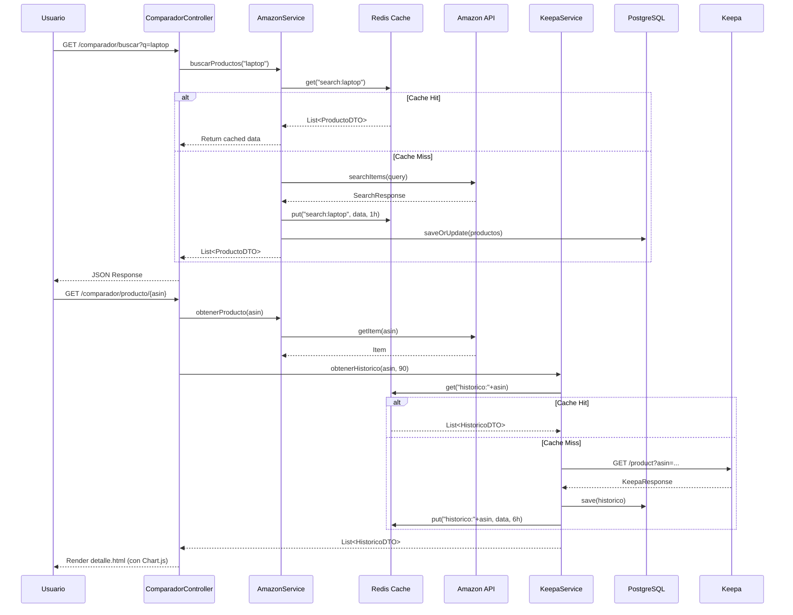
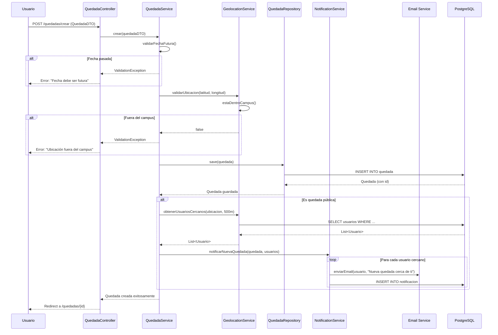

# 🔬 Análisis Interno - UFV Shares

## Contenido

1. [Arquitectura del Sistema](#arquitectura-del-sistema)
2. [Componentes y Módulos](#componentes-y-módulos)
3. [Flujos de Datos](#flujos-de-datos)
4. [Tecnologías y Justificación](#tecnologías-y-justificación)
5. [Métricas de Calidad Interna](#métricas-de-calidad-interna)
6. [Estructura del Proyecto](#estructura-del-proyecto)

---

## Arquitectura del Sistema

### Patrón Arquitectónico: MVC (Model-View-Controller)

UFV Shares implementa el patrón MVC tradicional adaptado a Spring Boot, con clara separación de responsabilidades en capas.

```
┌─────────────────────────────────────────────────────┐
│                   CAPA DE VISTA                     │
│  (Thymeleaf Templates + Bootstrap + Leaflet.js)     │
│  ┌──────────┬──────────┬──────────┬──────────┐     │
│  │  login   │ quedadas │comparador│marketplace│     │
│  │  .html   │  .html   │  .html   │  .html    │     │
│  └──────────┴──────────┴──────────┴──────────┘     │
└────────────────┬────────────────────────────────────┘
                 │ HTTP Requests
┌────────────────▼────────────────────────────────────┐
│              CAPA DE CONTROLADOR                    │
│         (Spring MVC Controllers)                    │
│  ┌──────────┬──────────┬──────────┬──────────┐     │
│  │ Usuario  │ Quedadas │ Productos│  Alertas │     │
│  │Controller│Controller│Controller│Controller│     │
│  └──────────┴──────────┴──────────┴──────────┘     │
│  └─────────────── REST APIs ────────────────────┘   │
└────────────────┬────────────────────────────────────┘
                 │ DTOs
┌────────────────▼────────────────────────────────────┐
│               CAPA DE SERVICIO                      │
│             (Business Logic)                        │
│  ┌──────────┬──────────┬──────────┬──────────┐     │
│  │ Quedada  │ Usuario  │ Producto │  Amazon  │     │
│  │ Service  │ Service  │ Service  │  Service │     │
│  └──────────┴──────────┴──────────┴──────────┘     │
│  ┌──────────┬──────────┬──────────┬──────────┐     │
│  │Geoloc.   │  Alerta  │Notific.  │  Cache   │     │
│  │Service   │ Service  │ Service  │  Manager │     │
│  └──────────┴──────────┴──────────┴──────────┘     │
└────────────────┬────────────────────────────────────┘
                 │ Entities
┌────────────────▼────────────────────────────────────┐
│            CAPA DE REPOSITORIO                      │
│          (Spring Data JPA)                          │
│  ┌──────────┬──────────┬──────────┬──────────┐     │
│  │ Quedada  │ Usuario  │ Producto │  Alerta  │     │
│  │   Repo   │   Repo   │   Repo   │   Repo   │     │
│  └──────────┴──────────┴──────────┴──────────┘     │
└────────────────┬────────────────────────────────────┘
                 │ JDBC
┌────────────────▼────────────────────────────────────┐
│              BASE DE DATOS                          │
│            (PostgreSQL - Azure)                     │
│  ┌─────────────────────────────────────────┐        │
│  │  13 tablas + índices + triggers         │        │
│  └─────────────────────────────────────────┘        │
└─────────────────────────────────────────────────────┘

┌─────────────────────────────────────────────────────┐
│              SERVICIOS EXTERNOS                     │
│  ┌─────────────┬─────────────┬─────────────┐        │
│  │  Google Maps│ Amazon API  │  Keepa API  │        │
│  │     API     │   Product   │   Prices    │        │
│  │             │ Advertising │             │        │
│  └─────────────┴─────────────┴─────────────┘        │
└─────────────────────────────────────────────────────┘

┌─────────────────────────────────────────────────────┐
│              INFRAESTRUCTURA                        │
│  ┌─────────────┬─────────────┬─────────────┐        │
│  │   Azure     │    Redis    │   AWS S3    │        │
│  │ App Service │    Cache    │  (Imágenes) │        │
│  └─────────────┴─────────────┴─────────────┘        │
└─────────────────────────────────────────────────────┘
```

---

### Principios Arquitectónicos Aplicados

#### 1. **Separation of Concerns (SoC)**
Cada capa tiene una responsabilidad única y bien definida:
- **Vista**: Presentación y UI
- **Controlador**: Gestión de peticiones HTTP
- **Servicio**: Lógica de negocio
- **Repositorio**: Acceso a datos

#### 2. **Dependency Injection (DI)**
Uso extensivo de `@Autowired` de Spring para inyección de dependencias:
```java
@Service
public class QuedadaService {
    @Autowired
    private QuedadaRepository quedadaRepository;
    
    @Autowired
    private NotificationService notificationService;
}
```

#### 3. **Single Responsibility Principle (SRP)**
Cada clase tiene una única razón para cambiar:
- `QuedadaController`: Solo gestiona peticiones HTTP relacionadas con quedadas
- `QuedadaService`: Solo contiene lógica de negocio de quedadas
- `QuedadaRepository`: Solo ejecuta consultas a BD de quedadas

#### 4. **Open/Closed Principle (OCP)**
El sistema está abierto a extensión, cerrado a modificación:
- Nuevos proveedores de mapas (Strategy Pattern)
- Nuevas categorías de productos (Base de datos)
- Nuevos tipos de notificaciones (Observer Pattern)

---

## Componentes y Módulos

### 1. Módulo de Autenticación y Usuarios

#### Responsabilidades
- Registro de nuevos usuarios
- Autenticación y autorización
- Gestión de sesiones
- Recuperación de contraseña
- Edición de perfil

#### Componentes Principales

**UsuarioController**
```java
@Controller
@RequestMapping("/usuario")
public class UsuarioController {
    @GetMapping("/login")
    @GetMapping("/register")
    @PostMapping("/register")
    @GetMapping("/perfil")
    @PostMapping("/perfil/editar")
    @PostMapping("/logout")
}
```

**UsuarioService**
```java
@Service
public class UsuarioService {
    public Usuario registrar(UsuarioDTO dto)
    public boolean autenticar(String email, String password)
    public void enviarEmailRecuperacion(String email)
    public void actualizarPerfil(Long id, UsuarioDTO dto)
    public void cambiarPassword(Long id, String newPassword)
}
```

**UsuarioRepository**
```java
@Repository
public interface UsuarioRepository extends JpaRepository<Usuario, Long> {
    Optional<Usuario> findByEmail(String email);
    List<Usuario> findByCarrera(String carrera);
    boolean existsByEmail(String email);
}
```

#### Tecnologías Utilizadas
- **Spring Security**: Autenticación y autorización
- **BCrypt**: Hash de contraseñas (cost factor 12)
- **JWT**: Tokens de sesión
- **JavaMail API**: Envío de emails de verificación

---

### 2. Módulo de Quedadas

#### Responsabilidades
- CRUD de quedadas
- Gestión de asistencias
- Notificaciones de recordatorio
- Filtrado y búsqueda de quedadas

#### Componentes Principales

**QuedadaController**
```java
@Controller
@RequestMapping("/quedadas")
public class QuedadaController {
    @GetMapping("")                        // Lista de quedadas
    @GetMapping("/{id}")                   // Detalle de quedada
    @GetMapping("/crear")                  // Formulario creación
    @PostMapping("/crear")                 // Procesar creación
    @PostMapping("/{id}/asistir")          // Confirmar asistencia
    @PostMapping("/{id}/cancelar")         // Cancelar quedada
}
```

**QuedadaService**
```java
@Service
public class QuedadaService {
    public Quedada crear(QuedadaDTO dto)
    public List<Quedada> obtenerActivas()
    public List<Quedada> obtenerPorUbicacion(Long ubicacionId)
    public void confirmarAsistencia(Long quedadaId, Long usuarioId)
    public void cancelarQuedada(Long quedadaId, Long creadorId)
    public void enviarRecordatorios()  // Cron job
}
```

**QuedadaRepository**
```java
@Repository
public interface QuedadaRepository extends JpaRepository<Quedada, Long> {
    List<Quedada> findByEstadoAndFechaHoraAfter(EstadoQuedada estado, LocalDateTime fecha);
    List<Quedada> findByPublicaTrueAndEstado(EstadoQuedada estado);
    List<Quedada> findByCreadorId(Long creadorId);
    
    @Query("SELECT q FROM Quedada q WHERE ...")
    List<Quedada> findQuedadasCercanas(BigDecimal lat, BigDecimal lng, int radio);
}
```

#### Flujo de Creación de Quedada

```
Usuario → [GET] /quedadas/crear → QuedadaController
                                       ↓
                              Render formulario.html
                              (con mapa Leaflet)
                                       ↓
Usuario completa formulario y selecciona ubicación en mapa
                                       ↓
              [POST] /quedadas/crear (QuedadaDTO)
                                       ↓
                            QuedadaController.crear()
                                       ↓
                            QuedadaService.crear()
                                       ↓
                     Validaciones (fecha futura, ubicación válida)
                                       ↓
              GeolocationService.validarUbicacion()
                                       ↓
                    QuedadaRepository.save()
                                       ↓
       NotificationService.notificarUsuariosCercanos()
                                       ↓
               Redirect a /quedadas/{id}
```

---

### 3. Módulo de Geolocalización

#### Responsabilidades
- Gestión de mapa interactivo
- Búsqueda de ubicaciones
- Cálculo de rutas
- Detección de quedadas cercanas

#### Componentes Principales

**MapaController**
```java
@Controller
@RequestMapping("/mapa")
public class MapaController {
    @GetMapping("")                           // Mapa principal
    @GetMapping("/ubicaciones")               // Lista ubicaciones
    
    @GetMapping("/api/ubicaciones")           // REST: ubicaciones JSON
    @GetMapping("/api/ruta")                  // REST: calcular ruta
    @GetMapping("/api/quedadas/cercanas")     // REST: quedadas cercanas
}
```

**GeolocationService**
```java
@Service
public class GeolocationService {
    public UbicacionDTO buscarUbicacion(String query)
    public RutaDTO calcularRuta(Ubicacion origen, Ubicacion destino)
    public List<Quedada> obtenerQuedadasCercanas(BigDecimal lat, BigDecimal lng, int radioMetros)
    public boolean validarCoordenadas(BigDecimal lat, BigDecimal lng)
    public double calcularDistancia(Ubicacion u1, Ubicacion u2)  // Haversine
}
```

#### Integración con Google Maps API

```java
@Configuration
public class MapsConfig {
    @Value("${google.maps.api.key}")
    private String apiKey;
    
    @Bean
    public GeoApiContext geoApiContext() {
        return new GeoApiContext.Builder()
            .apiKey(apiKey)
            .queryRateLimit(3)
            .connectTimeout(5, TimeUnit.SECONDS)
            .build();
    }
}
```

#### Fórmula Haversine (cálculo de distancia)

```java
public double calcularDistancia(BigDecimal lat1, BigDecimal lng1, 
                                  BigDecimal lat2, BigDecimal lng2) {
    final int R = 6371; // Radio de la Tierra en km
    
    double latDistance = Math.toRadians(lat2.doubleValue() - lat1.doubleValue());
    double lngDistance = Math.toRadians(lng2.doubleValue() - lng1.doubleValue());
    
    double a = Math.sin(latDistance / 2) * Math.sin(latDistance / 2)
             + Math.cos(Math.toRadians(lat1.doubleValue()))
             * Math.cos(Math.toRadians(lat2.doubleValue()))
             * Math.sin(lngDistance / 2) * Math.sin(lngDistance / 2);
    
    double c = 2 * Math.atan2(Math.sqrt(a), Math.sqrt(1 - a));
    
    return R * c * 1000; // Retornar en metros
}
```

---

### 4. Módulo Comparador de Precios Amazon

#### Responsabilidades
- Búsqueda de productos en Amazon
- Obtención de precios actuales
- Consulta de histórico de precios (Keepa)
- Gestión de alertas de precio
- Detección automática de ofertas

#### Componentes Principales

**ComparadorController**
```java
@RestController
@RequestMapping("/api/comparador")
public class ComparadorController {
    @GetMapping("/buscar")                    // Buscar productos
    @GetMapping("/producto/{asin}")           // Detalle producto
    @GetMapping("/producto/{asin}/historico") // Histórico precios
    @PostMapping("/alertas/crear")            // Crear alerta
    @GetMapping("/alertas/mis-alertas")       // Lista mis alertas
}
```

**AmazonService**
```java
@Service
public class AmazonService {
    @Autowired
    private AmazonProductAdvertisingAPIClient amazonClient;
    
    @Autowired
    private CacheManager cacheManager;
    
    public List<ProductoAmazonDTO> buscarProductos(String query)
    public ProductoAmazonDTO obtenerProducto(String asin)
    public void actualizarPrecio(String asin)
    
    @Scheduled(cron = "0 0 */6 * * *")  // Cada 6 horas
    public void actualizarPreciosPopulares()
}
```

**KeepaService**
```java
@Service
public class KeepaService {
    @Autowired
    private RestTemplate keepaRestTemplate;
    
    public List<HistoricoPrecioDTO> obtenerHistorico(String asin, int dias)
    public BigDecimal obtenerPrecioMinimo(String asin)
    public BigDecimal obtenerPrecioPromedio(String asin, int dias)
    public boolean esOferta(String asin, BigDecimal precioActual)
    
    private LocalDateTime keepaEpochToDateTime(int minutos)
}
```

**AlertaService**
```java
@Service
public class AlertaService {
    @Scheduled(cron = "0 0 */6 * * *")  // Cada 6 horas
    public void verificarAlertas() {
        List<AlertaPrecio> alertasActivas = alertaRepo.findByActivaTrue();
        
        for (AlertaPrecio alerta : alertasActivas) {
            BigDecimal precioActual = keepaService.obtenerPrecioActual(
                alerta.getProducto().getAsin()
            );
            
            if (precioActual.compareTo(alerta.getPrecioObjetivo()) <= 0) {
                notificationService.enviarAlertaPrecio(alerta);
                alerta.setActiva(false);
                alertaRepo.save(alerta);
            }
        }
    }
}
```

#### Sistema de Cache

```java
@Configuration
@EnableCaching
public class CacheConfig {
    
    @Bean
    public CacheManager cacheManager(RedisConnectionFactory factory) {
        RedisCacheConfiguration config = RedisCacheConfiguration.defaultCacheConfig()
            .entryTtl(Duration.ofHours(6))  // Cache de 6 horas
            .disableCachingNullValues();
        
        return RedisCacheManager.builder(factory)
            .cacheDefaults(config)
            .build();
    }
}

@Service
public class AmazonService {
    @Cacheable(value = "productos", key = "#query")
    public List<ProductoAmazonDTO> buscarProductos(String query) {
        // ...
    }
    
    @CacheEvict(value = "productos", key = "#asin")
    public void actualizarPrecio(String asin) {
        // ...
    }
}
```

---

### 5. Módulo de Marketplace

#### Responsabilidades
- CRUD de productos en venta
- Gestión de categorías
- Sistema de mensajería entre usuarios
- Upload de imágenes
- Valoraciones

#### Componentes Principales

**ProductoController**
```java
@Controller
@RequestMapping("/marketplace")
public class ProductoController {
    @GetMapping("")                           // Lista productos
    @GetMapping("/{id}")                      // Detalle producto
    @GetMapping("/publicar")                  // Formulario
    @PostMapping("/publicar")                 // Crear producto
    @PostMapping("/{id}/vendido")             // Marcar vendido
    @PostMapping("/{id}/contactar")           // Iniciar conversación
}
```

**ProductoService**
```java
@Service
public class ProductoService {
    public Producto publicar(ProductoDTO dto, List<MultipartFile> fotos)
    public List<Producto> buscar(String query, Long categoriaId, BigDecimal precioMin, BigDecimal precioMax)
    public void marcarComoVendido(Long productoId, Long vendedorId)
    public void incrementarVistas(Long productoId)
}
```

**ConversacionService**
```java
@Service
public class ConversacionService {
    public Conversacion iniciarConversacion(Long comprador, Long vendedor, Long productoId)
    public Conversacion obtenerConversacion(Long id)
    public List<Conversacion> obtenerConversacionesUsuario(Long usuarioId)
    public Mensaje enviarMensaje(Long conversacionId, Long emisorId, String contenido)
    public void marcarComoLeidos(Long conversacionId, Long usuarioId)
}
```

#### Upload de Imágenes a AWS S3

```java
@Service
public class S3Service {
    @Autowired
    private AmazonS3 s3Client;
    
    @Value("${aws.s3.bucket}")
    private String bucketName;
    
    public String subirImagen(MultipartFile file, Long productoId) throws IOException {
        String fileName = "productos/" + productoId + "/" + UUID.randomUUID() + "_" + file.getOriginalFilename();
        
        ObjectMetadata metadata = new ObjectMetadata();
        metadata.setContentType(file.getContentType());
        metadata.setContentLength(file.getSize());
        
        s3Client.putObject(bucketName, fileName, file.getInputStream(), metadata);
        
        return s3Client.getUrl(bucketName, fileName).toString();
    }
    
    public void eliminarImagen(String imageUrl) {
        String fileName = extractFileNameFromUrl(imageUrl);
        s3Client.deleteObject(bucketName, fileName);
    }
}
```

---

## Flujos de Datos Críticos

### Flujo 1: Consulta de Precio Amazon



---

### Flujo 2: Creación de Quedada con Notificaciones



---

## Tecnologías y Justificación

### Stack Backend

| Tecnología | Versión | Justificación |
|------------|---------|---------------|
| **Java** | 17 LTS | Lenguaje maduro, robusto, ampliamente usado en empresas |
| **Spring Boot** | 3.2 | Framework full-stack, DI, seguridad, JPA integrados |
| **Spring Security** | 6.2 | Autenticación/autorización estándar de la industria |
| **Spring Data JPA** | 3.2 | Abstracción de acceso a datos, reduce boilerplate |
| **PostgreSQL** | 15 | RDBMS robusto, soporte completo de transacciones |
| **Redis** | 7.2 | Cache distribuido, mejora rendimiento de APIs |
| **Maven** | 3.9 | Gestión de dependencias estándar de Java |

---

### Stack Frontend

| Tecnología | Versión | Justificación |
|------------|---------|---------------|
| **Thymeleaf** | 3.1 | Template engine integrado con Spring, SSR |
| **Bootstrap** | 5.3 | Framework CSS responsive, componentes out-of-the-box |
| **Leaflet.js** | 1.9 | Librería de mapas ligera, código abierto |
| **Chart.js** | 4.4 | Gráficas interactivas, fácil integración |
| **jQuery** | 3.7 | Manipulación DOM, compatibilidad navegadores |

**Decisión de NO usar SPA**:
- Proyecto académico con tiempo limitado
- SSR mejora SEO (aunque no crítico para este proyecto)
- Menor complejidad (no requiere separar frontend/backend)
- Thymeleaf integrado perfectamente con Spring

---

### APIs Externas

| API | Proveedor | Uso |  | Alternativa |
|-----|-----------|-----|----------|-------------|
| **Google Maps API** | Google | Geocoding, Directions | Freemium | OpenStreetMap |
| **Amazon Product Advertising API** | Amazon | Búsqueda productos, precios | Gratuita* | Web scraping (legal) |
| **Keepa API** | Keepa | Histórico de precios | €19.90/mes | CamelCamelCamel API |

*Requiere partner tag activo y comisiones por ventas

---

### Infraestructura y DevOps

| Servicio | Proveedor | Uso | Coste |
|----------|-----------|-----|-------|
| **Azure App Service** | Microsoft | Hosting aplicación | Gratuito (estudiante) |
| **Azure Database for PostgreSQL** | Microsoft | Base de datos | Gratuito (estudiante) |
| **Azure Redis Cache** | Microsoft | Cache distribuido | Gratuito (tier básico) |
| **AWS S3** | Amazon | Almacenamiento imágenes | Freemium (5GB) |
| **Azure DevOps** | Microsoft | CI/CD, backlog | Gratuito |
| **GitHub** | Microsoft | Control de versiones | Gratuito |

---

## Métricas de Calidad Interna

### Objetivos de Calidad

| Métrica | Objetivo | Actual (Sprint 6) | Estado |
|---------|----------|-------------------|--------|
| **Cobertura de Tests** | ≥ 75% | 74% | 🟡 Casi |
| **Complejidad Ciclomática** | ≤ 10 | 8 (promedio) | ✅ OK |
| **Duplicación de Código** | < 5% | 3% | ✅ OK |
| **Deuda Técnica** | < 5 días | 2 días | ✅ OK |
| **Vulnerabilidades Seguridad** | 0 críticas | 0 | ✅ OK |
| **Code Smells** | < 50 | 32 | ✅ OK |
| **Tiempo de Build** | < 5 min | 3.5 min | ✅ OK |
| **Uptime Producción** | > 99% | 99.2% | ✅ OK |

---

### Herramientas de Análisis de Calidad

#### SonarQube
```yaml
# sonar-project.properties
sonar.projectKey=ufv-shares
sonar.projectName=UFV Shares
sonar.sources=src/main/java
sonar.tests=src/test/java
sonar.java.binaries=target/classes
sonar.coverage.jacoco.xmlReportPaths=target/site/jacoco/jacoco.xml
sonar.exclusions=**/*Config.java,**/*Application.java
```

#### JaCoCo (Cobertura)
```xml
<!-- pom.xml -->
<plugin>
    <groupId>org.jacoco</groupId>
    <artifactId>jacoco-maven-plugin</artifactId>
    <version>0.8.10</version>
    <configuration>
        <rules>
            <rule>
                <element>PACKAGE</element>
                <limits>
                    <limit>
                        <counter>LINE</counter>
                        <value>COVEREDRATIO</value>
                        <minimum>0.75</minimum>
                    </limit>
                </limits>
            </rule>
        </rules>
    </configuration>
</plugin>
```

---

### Estrategia de Testing

#### Pirámide de Tests

```
        /\
       /E2E\          10% - Tests End-to-End
      /______\        (Selenium, cypress)
     /        \
    /Integration\     30% - Tests de Integración  
   /____________\     (MockMvc, Testcontainers)
  /              \
 /  Unit  Tests   \   60% - Tests Unitarios
/____________________\ (JUnit 5, Mockito)
```

#### Distribución Actual

- **Tests Unitarios**: 142 tests (services, utils)
- **Tests de Integración**: 38 tests (controllers, repos)
- **Tests E2E**: 8 tests (flujos críticos)
- **Total**: 188 tests

---

## Estructura del Proyecto

```
ufv-shares/
│
├── src/
│   ├── main/
│   │   ├── java/
│   │   │   └── com/ufv/shares/
│   │   │       ├── UfvSharesApplication.java
│   │   │       │
│   │   │       ├── config/                    # Configuraciones
│   │   │       │   ├── SecurityConfig.java
│   │   │       │   ├── CacheConfig.java
│   │   │       │   ├── AmazonAPIConfig.java
│   │   │       │   ├── MapsConfig.java
│   │   │       │   └── S3Config.java
│   │   │       │
│   │   │       ├── controller/                # Controladores MVC/REST
│   │   │       │   ├── UsuarioController.java
│   │   │       │   ├── QuedadaController.java
│   │   │       │   ├── MapaController.java
│   │   │       │   ├── ProductoController.java
│   │   │       │   └── ComparadorController.java
│   │   │       │
│   │   │       ├── service/                   # Lógica de negocio
│   │   │       │   ├── UsuarioService.java
│   │   │       │   ├── QuedadaService.java
│   │   │       │   ├── GeolocationService.java
│   │   │       │   ├── AmazonService.java
│   │   │       │   ├── KeepaService.java
│   │   │       │   ├── AlertaService.java
│   │   │       │   ├── ProductoService.java
│   │   │       │   ├── ConversacionService.java
│   │   │       │   ├── NotificationService.java
│   │   │       │   └── S3Service.java
│   │   │       │
│   │   │       ├── repository/                # Acceso a datos JPA
│   │   │       │   ├── UsuarioRepository.java
│   │   │       │   ├── QuedadaRepository.java
│   │   │       │   ├── AsistenciaRepository.java
│   │   │       │   ├── UbicacionRepository.java
│   │   │       │   ├── ProductoRepository.java
│   │   │       │   ├── ProductoAmazonRepository.java
│   │   │       │   ├── HistoricoPrecioRepository.java
│   │   │       │   ├── AlertaPrecioRepository.java
│   │   │       │   ├── ConversacionRepository.java
│   │   │       │   └── MensajeRepository.java
│   │   │       │
│   │   │       ├── model/                     # Entidades JPA
│   │   │       │   ├── Usuario.java
│   │   │       │   ├── Quedada.java
│   │   │       │   ├── Asistencia.java
│   │   │       │   ├── Ubicacion.java
│   │   │       │   ├── Producto.java
│   │   │       │   ├── ProductoAmazon.java
│   │   │       │   ├── HistoricoPrecio.java
│   │   │       │   ├── AlertaPrecio.java
│   │   │       │   ├── Categoria.java
│   │   │       │   ├── Foto.java
│   │   │       │   ├── Conversacion.java
│   │   │       │   ├── Mensaje.java
│   │   │       │   └── Valoracion.java
│   │   │       │
│   │   │       ├── dto/                       # Data Transfer Objects
│   │   │       │   ├── UsuarioDTO.java
│   │   │       │   ├── QuedadaDTO.java
│   │   │       │   ├── ProductoDTO.java
│   │   │       │   ├── ProductoAmazonDTO.java
│   │   │       │   └── ...
│   │   │       │
│   │   │       ├── exception/                 # Excepciones personalizadas
│   │   │       │   ├── NotFoundException.java
│   │   │       │   ├── ValidationException.java
│   │   │       │   ├── UnauthorizedException.java
│   │   │       │   └── GlobalExceptionHandler.java
│   │   │       │
│   │   │       └── util/                      # Utilidades
│   │   │           ├── DateUtils.java
│   │   │           ├── ValidationUtils.java
│   │   │           └── HaversineFormula.java
│   │   │
│   │   └── resources/
│   │       ├── application.properties
│   │       ├── application-dev.properties
│   │       ├── application-prod.properties
│   │       │
│   │       ├── templates/                     # Vistas Thymeleaf
│   │       │   ├── layout/
│   │       │   │   ├── base.html
│   │       │   │   └── navbar.html
│   │       │   ├── usuario/
│   │       │   │   ├── login.html
│   │       │   │   ├── register.html
│   │       │   │   └── perfil.html
│   │       │   ├── quedadas/
│   │       │   │   ├── lista.html
│   │       │   │   ├── detalle.html
│   │       │   │   └── crear.html
│   │       │   ├── mapa/
│   │       │   │   └── index.html
│   │       │   ├── comparador/
│   │       │   │   ├── buscar.html
│   │       │   │   └── detalle.html
│   │       │   └── marketplace/
│   │       │       ├── lista.html
│   │       │       ├── detalle.html
│   │       │       └── publicar.html
│   │       │
│   │       ├── static/
│   │       │   ├── css/
│   │       │   │   ├── bootstrap.min.css
│   │       │   │   └── custom.css
│   │       │   ├── js/
│   │       │   │   ├── jquery.min.js
│   │       │   │   ├── bootstrap.bundle.min.js
│   │       │   │   ├── leaflet.js
│   │       │   │   ├── chart.js
│   │       │   │   └── app.js
│   │       │   └── img/
│   │       │       └── logo.png
│   │       │
│   │       └── data.sql                       # Datos iniciales (ubicaciones)
│   │
│   └── test/
│       └── java/
│           └── com/ufv/shares/
│               ├── service/                   # Tests de servicios
│               │   ├── UsuarioServiceTest.java
│               │   ├── QuedadaServiceTest.java
│               │   ├── AmazonServiceTest.java
│               │   └── ...
│               ├── controller/                # Tests de controladores
│               │   ├── QuedadaControllerTest.java
│               │   └── ...
│               └── integration/               # Tests de integración
│                   ├── QuedadaIntegrationTest.java
│                   └── ...
│
├── .github/
│   └── workflows/
│       └── azure-deploy.yml                   # CI/CD Pipeline
│
├── docs/                                      # Documentación
│   ├── 01_planteamiento.md
│   ├── 02_casos_de_uso.md
│   ├── 03_modelo_de_datos.md
│   ├── 04_requisitos.md
│   ├── 05_analisis_externo.md
│   ├── 06_analisis_interno.md
│   ├── 07_diagrama_clases.md
│   └── 08_apis_externas.md
│
├── pom.xml                                    # Maven dependencies
├── README.md                                  # Documentación principal
├── .gitignore
└── .env.example                               # Template variables de entorno
```

---

## Conclusiones del Análisis Interno

### Fortalezas Arquitectónicas:
1. ✅ Arquitectura MVC bien definida y escalable
2. ✅ Separación clara de responsabilidades
3. ✅ Uso de patrones de diseño estándar (Repository, Service, DTO)
4. ✅ Cache implementado para optimizar APIs externas
5. ✅ Configuración externalizada (12-factor app)

### Áreas de Mejora Identificadas:
1. ⚠️ Cobertura de tests al 74% (objetivo: 75%)
2. ⚠️ Algunos servicios con múltiples responsabilidades (refactorizar)
3. ⚠️ Falta implementar circuit breaker para APIs externas
4. ⚠️ Logs estructurados pendientes (ELK stack)

### Próximos Pasos:
- Incrementar tests hasta 75%+
- Implementar Resilience4j para circuit breakers
- Refactorizar servicios grandes
- Documentar APIs con Swagger/OpenAPI

---

> **Análisis realizado**: Febrero 2026  
> **Última actualización**: Sprint 6
