# 🏗️ Diagrama de Clases - UFV Shares

## Diagrama UML Completo

```mermaid
classDiagram
    class Usuario {
        -Long id
        -String email
        -String password
        -String nombre
        -String apellidos
        -String carrera
        -Integer curso
        -LocalDateTime createdAt
        -Boolean activo
        +autenticar()
        +actualizarPerfil()
        +crearQuedada()
    }

    class Quedada {
        -Long id
        -Usuario creador
        -String titulo
        -String descripcion
        -LocalDateTime fechaHora
        -Ubicacion ubicacion
        -Boolean publica
        -Integer maxParticipantes
        -EstadoQuedada estado
        -Set~Asistencia~ asistencias
        +confirmarAsistencia()
        +cancelar()
        +estaCompleta()
        +getNumeroAsistentes()
    }

    class Ubicacion {
        -Long id
        -String nombre
        -String descripcion
        -BigDecimal latitud
        -BigDecimal longitud
        -TipoUbicacion tipo
        +calcularDistancia(Ubicacion)
        +validarCoordenadas()
    }

    class Asistencia {
        -Long id
        -Usuario usuario
        -Quedada quedada
        -EstadoAsistencia estado
        -LocalDateTime confirmadoAt
        +confirmar()
        +cancelar()
    }

    class Producto {
        -Long id
        -Usuario vendedor
        -String titulo
        -String descripcion
        -BigDecimal precio
        -Categoria categoria
        -EstadoProducto estadoProducto
        -EstadoVenta estadoVenta
        -Ubicacion ubicacion
        -List~Foto~ fotos
        +publicar()
        +marcarComoVendido()
        +actualizarPrecio()
    }

    class ProductoAmazon {
        -Long id
        -String asin
        -String titulo
        -String url
        -BigDecimal precioActual
        -String imagenUrl
        -LocalDateTime ultimaActualizacion
        -List~HistoricoPrecio~ historico
        +actualizarPrecio()
        +getPrecioMinimo()
        +getPrecioPromedio()
        +esOferta()
    }

    class HistoricoPrecio {
        -Long id
        -ProductoAmazon producto
        -BigDecimal precio
        -LocalDateTime fecha
        -String fuente
        +compararCon(HistoricoPrecio)
    }

    class AlertaPrecio {
        -Long id
        -Usuario usuario
        -ProductoAmazon producto
        -BigDecimal precioObjetivo
        -Boolean activa
        -LocalDateTime createdAt
        +verificar()
        +notificar()
        +desactivar()
    }

    class Categoria {
        -Long id
        -String nombre
        -String icono
        +getProductos()
    }

    class Foto {
        -Long id
        -String url
        -Producto producto
        -LocalDateTime uploadedAt
        +eliminar()
    }

    class Conversacion {
        -Long id
        -Usuario usuario1
        -Usuario usuario2
        -Producto producto
        -LocalDateTime createdAt
        -LocalDateTime ultimoMensaje
        +enviarMensaje()
        +marcarComoLeida()
    }

    class Mensaje {
        -Long id
        -Conversacion conversacion
        -Usuario remitente
        -String contenido
        -LocalDateTime enviadoAt
        -Boolean leido
        +marcarLeido()
    }

    class Valoracion {
        -Long id
        -Usuario evaluador
        -Usuario evaluado
        -Integer puntuacion
        -String comentario
        -LocalDateTime createdAt
        +validarPuntuacion()
    }

    class QuedadaService {
        +crearQuedada(QuedadaDTO)
        +obtenerQuedadasActivas()
        +confirmarAsistencia(Long, Long)
        +cancelarQuedada(Long)
        +enviarRecordatorios()
    }

    class AmazonService {
        -AmazonAPIClient apiClient
        -KeepaAPIClient keepaClient
        -CacheManager cache
        +buscarProducto(String)
        +obtenerPrecioActual(String)
        +obtenerHistorico(String, int)
        +actualizarPrecios()
    }

    class GeolocationService {
        -MapsAPIClient mapsClient
        +validarCoordenadas(BigDecimal, BigDecimal)
        +calcularRuta(Ubicacion, Ubicacion)
        +buscarUbicacion(String)
        +obtenerUbicacionesCercanas(BigDecimal, BigDecimal)
    }

    class NotificationService {
        +enviarNotificacion(Usuario, String)
        +enviarRecordatorioQuedada(Quedada)
        +enviarAlertaPrecio(AlertaPrecio)
    }

    class AlertaService {
        -AlertaPrecioRepository alertaRepo
        -KeepaService keepaService
        +verificarAlertas()
        +crearAlerta(Long, String, BigDecimal)
        +desactivarAlerta(Long)
    }

    class MarketplaceService {
        -ProductoRepository productoRepo
        -S3Service s3Service
        +publicarProducto(ProductoDTO)
        +buscarProductos(String, Categoria)
        +marcarComoVendido(Long)
        +subirFotos(Long, List~MultipartFile~)
    }

    %% Relaciones entre Entidades
    Usuario "1" --> "*" Quedada : crea
    Usuario "1" --> "*" Asistencia : participa
    Usuario "1" --> "*" Producto : vende
    Usuario "1" --> "*" AlertaPrecio : configura
    Usuario "1" --> "*" Conversacion : participa_en
    Usuario "1" --> "*" Valoracion : evalúa
    Usuario "1" --> "*" Valoracion : es_evaluado
    
    Quedada "1" --> "1" Ubicacion : se_realiza_en
    Quedada "1" --> "*" Asistencia : tiene
    
    Producto "1" --> "1" Categoria : pertenece
    Producto "1" --> "0..1" Ubicacion : se_entrega_en
    Producto "1" --> "*" Foto : contiene
    Producto "1" --> "*" Conversacion : relacionado_con
    
    ProductoAmazon "1" --> "*" HistoricoPrecio : registra
    ProductoAmazon "1" --> "*" AlertaPrecio : monitorea
    
    Conversacion "1" --> "*" Mensaje : contiene
    Conversacion "1" --> "2" Usuario : entre
    
    Asistencia "*" --> "1" Usuario
    Asistencia "*" --> "1" Quedada
    
    %% Relaciones de Servicios con Entidades
    QuedadaService ..> Quedada : gestiona
    QuedadaService ..> Asistencia : gestiona
    QuedadaService ..> NotificationService : usa
    QuedadaService ..> GeolocationService : usa
    
    AmazonService ..> ProductoAmazon : gestiona
    AmazonService ..> HistoricoPrecio : gestiona
    
    GeolocationService ..> Ubicacion : gestiona
    
    AlertaService ..> AlertaPrecio : gestiona
    AlertaService ..> AmazonService : usa
    AlertaService ..> NotificationService : usa
    
    MarketplaceService ..> Producto : gestiona
    MarketplaceService ..> Foto : gestiona
    MarketplaceService ..> Categoria : usa

    %% Enumeraciones
    class EstadoQuedada {
        <<enumeration>>
        PENDIENTE
        EN_CURSO
        FINALIZADA
        CANCELADA
    }

    class EstadoAsistencia {
        <<enumeration>>
        CONFIRMADA
        PENDIENTE
        CANCELADA
    }

    class EstadoProducto {
        <<enumeration>>
        NUEVO
        COMO_NUEVO
        BUEN_ESTADO
        ACEPTABLE
    }

    class EstadoVenta {
        <<enumeration>>
        DISPONIBLE
        RESERVADO
        VENDIDO
    }

    class TipoUbicacion {
        <<enumeration>>
        AULA
        BIBLIOTECA
        CAFETERIA
        ZONA_VERDE
        EDIFICIO
        DEPORTIVO
        OTRO
    }

    Quedada --> EstadoQuedada
    Asistencia --> EstadoAsistencia
    Producto --> EstadoProducto
    Producto --> EstadoVenta
    Ubicacion --> TipoUbicacion
```



---

## 📋 Descripción de Clases Principales

### Entidades de Dominio

#### **Usuario**
- **Responsabilidad**: Gestionar información de los estudiantes registrados
- **Atributos clave**: email (único), password (encriptado BCrypt), carrera, curso
- **Relaciones**: Puede crear quedadas, participar en ellas, vender productos, configurar alertas

#### **Quedada**
- **Responsabilidad**: Representar un evento o encuentro organizado por estudiantes
- **Atributos clave**: fechaHora, ubicacion, maxParticipantes, estado
- **Lógica de negocio**: 
  - `estaCompleta()`: Verifica si se alcanzó el máximo de participantes
  - `confirmarAsistencia()`: Valida disponibilidad antes de confirmar
  - `cancelar()`: Solo el creador puede cancelar

#### **Ubicacion**
- **Responsabilidad**: Almacenar puntos geográficos del campus UFV
- **Atributos clave**: latitud, longitud, tipo (enum)
- **Métodos**: `calcularDistancia()` implementa fórmula Haversine para distancias reales

#### **ProductoAmazon**
- **Responsabilidad**: Representar productos de Amazon con seguimiento de precio
- **Atributos clave**: asin (identificador único Amazon), precioActual, ultimaActualizacion
- **Métodos analíticos**: 
  - `getPrecioMinimo()`: Consulta histórico para encontrar mínimo
  - `esOferta()`: Compara precio actual con promedio 30 días

#### **AlertaPrecio**
- **Responsabilidad**: Sistema de notificaciones cuando precio objetivo se alcanza
- **Lógica**: Tarea programada verifica alertas activas cada 6 horas

### Servicios (Capa de Negocio)

#### **QuedadaService**
- **Responsabilidad**: Lógica de negocio para gestión de quedadas
- **Operaciones**:
  - Crear quedada con validación de ubicación
  - Confirmar asistencia verificando disponibilidad
  - Enviar recordatorios 24h antes del evento
  - Cancelar quedada y notificar asistentes

#### **AmazonService**
- **Responsabilidad**: Integración con Amazon Product Advertising API
- **Operaciones**:
  - Búsqueda de productos con cache (1 hora TTL)
  - Obtención de detalles por ASIN
  - Actualización masiva nocturna de productos populares
  - Integración con Keepa para históricos

#### **GeolocationService**
- **Responsabilidad**: Gestión de mapas y geolocalización
- **Operaciones**:
  - Búsqueda de ubicaciones en campus UFV
  - Cálculo de rutas a pie entre dos puntos
  - Detección de quedadas cercanas (radio configurable)
  - Validación de coordenadas dentro del campus

#### **NotificationService**
- **Responsabilidad**: Sistema centralizado de notificaciones
- **Canales**: Email (principal), push notifications (futuro), in-app
- **Tipos**: Recordatorios quedadas, alertas precio, mensajes marketplace

---

## 🎯 Patrones de Diseño Implementados

### 1. **Repository Pattern**
- **Uso**: Todas las entidades tienen su `@Repository` JPA
- **Beneficio**: Abstracción completa de la capa de persistencia
- **Ejemplo**:
```java
public interface QuedadaRepository extends JpaRepository<Quedada, Long> {
    List<Quedada> findByEstadoAndFechaHoraAfter(EstadoQuedada estado, LocalDateTime fecha);
}
```

### 2. **Service Layer Pattern**
- **Uso**: Capa intermedia entre controladores y repositorios
- **Beneficio**: Lógica de negocio centralizada y reutilizable
- **Separación clara**: Controladores solo manejan HTTP, servicios contienen reglas

### 3. **DTO (Data Transfer Object) Pattern**
- **Uso**: Transferencia de datos entre capas sin exponer entidades
- **Beneficio**: Desacoplamiento y control sobre datos expuestos en API
- **Ejemplo**: `QuedadaDTO` no expone password del creador

### 4. **Strategy Pattern**
- **Uso**: Diferentes proveedores de mapas (Google Maps vs OpenStreetMap)
- **Interfaz**: `MapProvider` con implementaciones intercambiables
- **Beneficio**: Flexibilidad para cambiar proveedor sin modificar servicios

### 5. **Observer Pattern**
- **Uso**: Sistema de notificaciones y eventos
- **Implementación**: Spring Events (`@EventListener`)
- **Ejemplo**: Cuando se crea una quedada → evento → notificar seguidores

### 6. **Singleton Pattern**
- **Uso**: Servicios gestionados por Spring (`@Service`, `@Component`)
- **Beneficio**: Una única instancia compartida, gestión automática de dependencias

### 7. **Builder Pattern**
- **Uso**: Construcción de objetos complejos (DTOs, entidades)
- **Implementación**: Lombok `@Builder`
- **Ejemplo**: 
```java
ProductoAmazonDTO.builder()
    .asin("B08N5WRWNW")
    .titulo("Libro Java")
    .precio(new BigDecimal("29.99"))
    .build();
```

### 8. **Factory Pattern**
- **Uso**: Creación de notificaciones según tipo
- **Implementación**: `NotificationFactory` determina canal apropiado
- **Beneficio**: Lógica de creación centralizada

---

## 🔗 Relaciones y Multiplicidades

### Relaciones Clave

| Relación | Tipo | Multiplicidad | Descripción |
|----------|------|---------------|-------------|
| Usuario → Quedada | Uno a Muchos | 1:N | Un usuario puede crear múltiples quedadas |
| Quedada → Asistencia | Uno a Muchos | 1:N | Una quedada tiene múltiples asistencias |
| Usuario → Asistencia | Uno a Muchos | 1:N | Un usuario puede confirmar asistencia a múltiples quedadas |
| Producto → Foto | Uno a Muchos | 1:N | Un producto puede tener hasta 5 fotos |
| ProductoAmazon → HistoricoPrecio | Uno a Muchos | 1:N | Un producto Amazon tiene múltiples registros de precio |
| Usuario → AlertaPrecio | Uno a Muchos | 1:N | Un usuario puede configurar hasta 10 alertas |
| Conversacion → Mensaje | Uno a Muchos | 1:N | Una conversación contiene múltiples mensajes |
| Usuario ↔ Usuario (Conversacion) | Muchos a Muchos | N:M | Usuarios conversan entre sí (tabla intermedia Conversacion) |

### Restricciones de Integridad

- **Usuario**: Email único, password no nulo (mínimo 8 caracteres)
- **Quedada**: FechaHora futura, maxParticipantes ≥ 2
- **Producto**: Precio > 0, máximo 5 fotos
- **AlertaPrecio**: PrecioObjetivo > 0, máximo 10 alertas activas por usuario
- **Valoracion**: Puntuación entre 1-5, un usuario no puede valorarse a sí mismo

---

## 🛠️ Implementación Técnica

### Anotaciones JPA Principales

```java
@Entity
@Table(name = "quedadas", indexes = {
    @Index(name = "idx_estado_fecha", columnList = "estado, fecha_hora")
})
public class Quedada {
    
    @Id
    @GeneratedValue(strategy = GenerationType.IDENTITY)
    private Long id;
    
    @ManyToOne(fetch = FetchType.LAZY)
    @JoinColumn(name = "creador_id", nullable = false)
    private Usuario creador;
    
    @OneToOne(cascade = CascadeType.ALL)
    @JoinColumn(name = "ubicacion_id")
    private Ubicacion ubicacion;
    
    @OneToMany(mappedBy = "quedada", cascade = CascadeType.ALL, orphanRemoval = true)
    private Set<Asistencia> asistencias = new HashSet<>();
    
    @Enumerated(EnumType.STRING)
    private EstadoQuedada estado;
    
    // ... getters, setters, métodos de negocio
}
```

### Validaciones con Bean Validation

```java
@NotBlank(message = "El título es obligatorio")
@Size(min = 5, max = 100, message = "El título debe tener entre 5 y 100 caracteres")
private String titulo;

@NotNull(message = "La fecha es obligatoria")
@Future(message = "La fecha debe ser futura")
private LocalDateTime fechaHora;

@Min(value = 2, message = "Mínimo 2 participantes")
@Max(value = 50, message = "Máximo 50 participantes")
private Integer maxParticipantes;
```

---

## 📊 Métricas de Diseño

- **Total de clases**: 23 (13 entidades + 6 servicios + 4 auxiliares)
- **Total de relaciones**: 18
- **Nivel de acoplamiento**: BAJO (servicios independientes)
- **Cohesión**: ALTA (cada clase tiene responsabilidad única)
- **Profundidad de herencia**: 0 (sin jerarquías complejas)
- **Patrones aplicados**: 8

---

## 🎓 Conclusiones del Diseño

### Fortalezas
✅ Separación clara de responsabilidades (MVC + Service Layer)  
✅ Alta cohesión y bajo acoplamiento entre módulos  
✅ Uso extensivo de patrones de diseño probados  
✅ Modelo de datos normalizado (3FN)  
✅ Escalabilidad mediante servicios independientes  

### Áreas de Mejora Futuras
🔄 Implementar Event Sourcing para auditoría completa  
🔄 Agregar CQRS para separar lecturas de escrituras  
🔄 Migrar a arquitectura de microservicios si escala  

---

**Documento generado para**: UFV Shares - Proyectos II (3º Año)  
**Profesor**: Roberto Rodríguez Galán  
**Fecha**: Sprint 2 - Fase de Diseño
