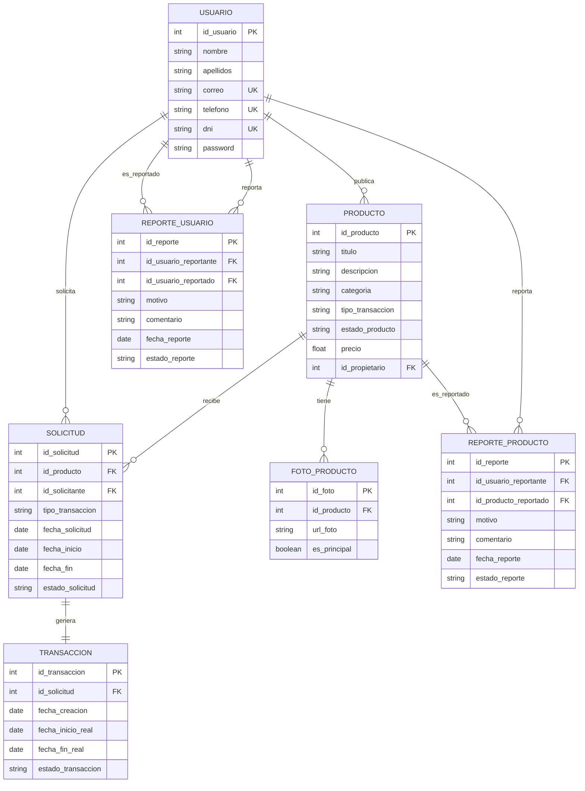
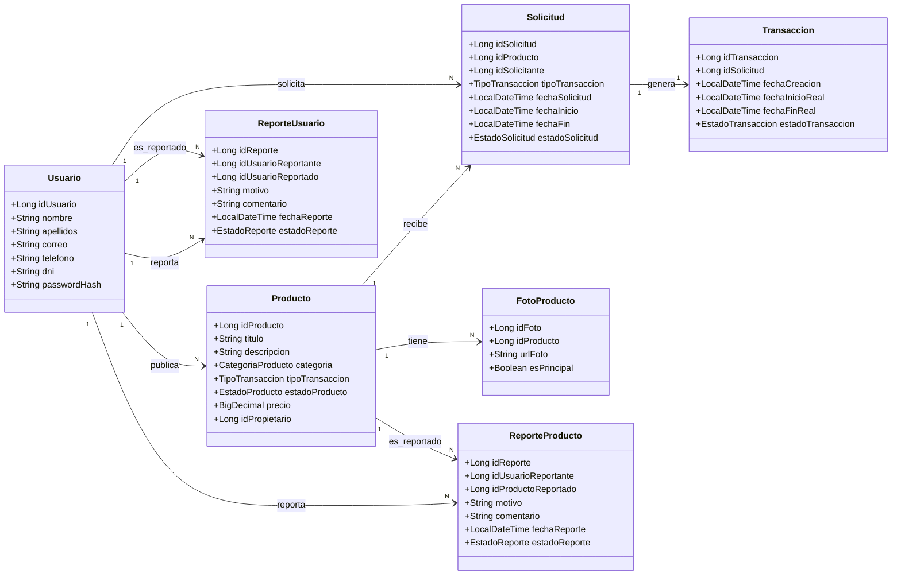
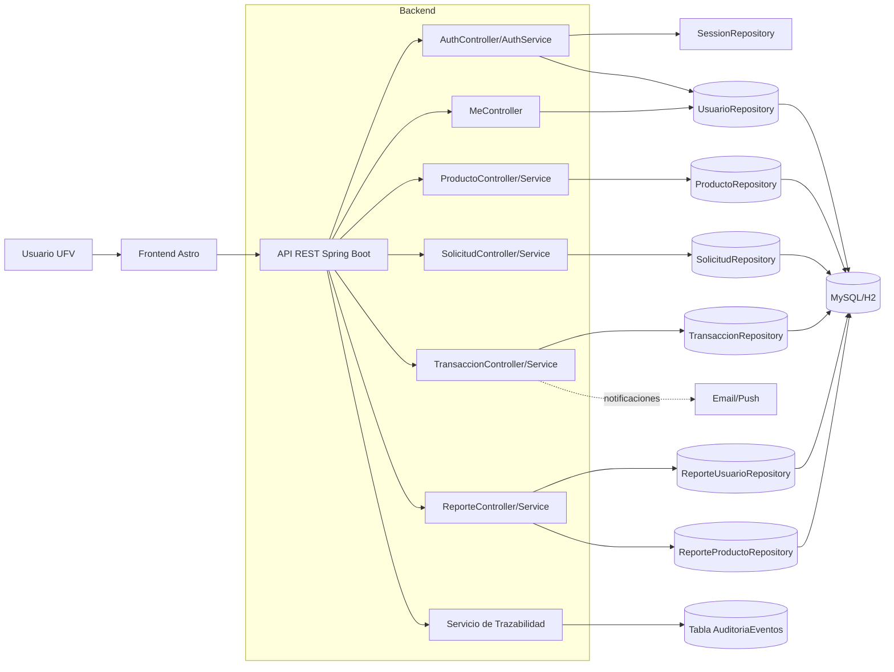
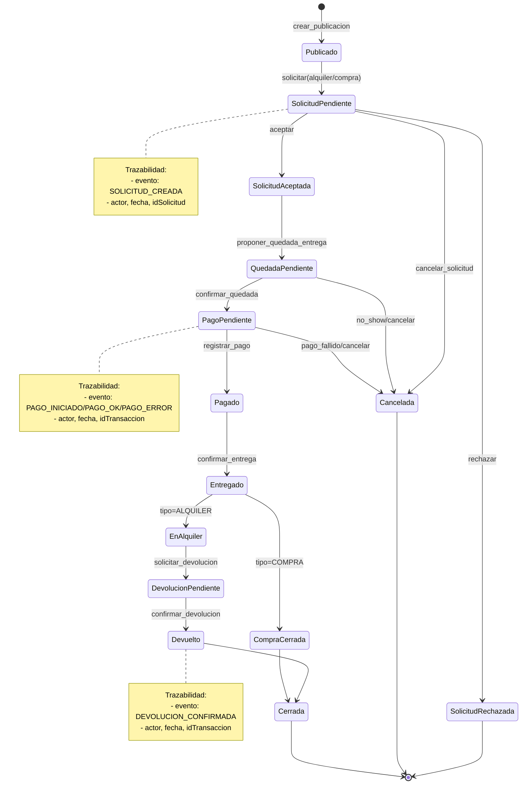
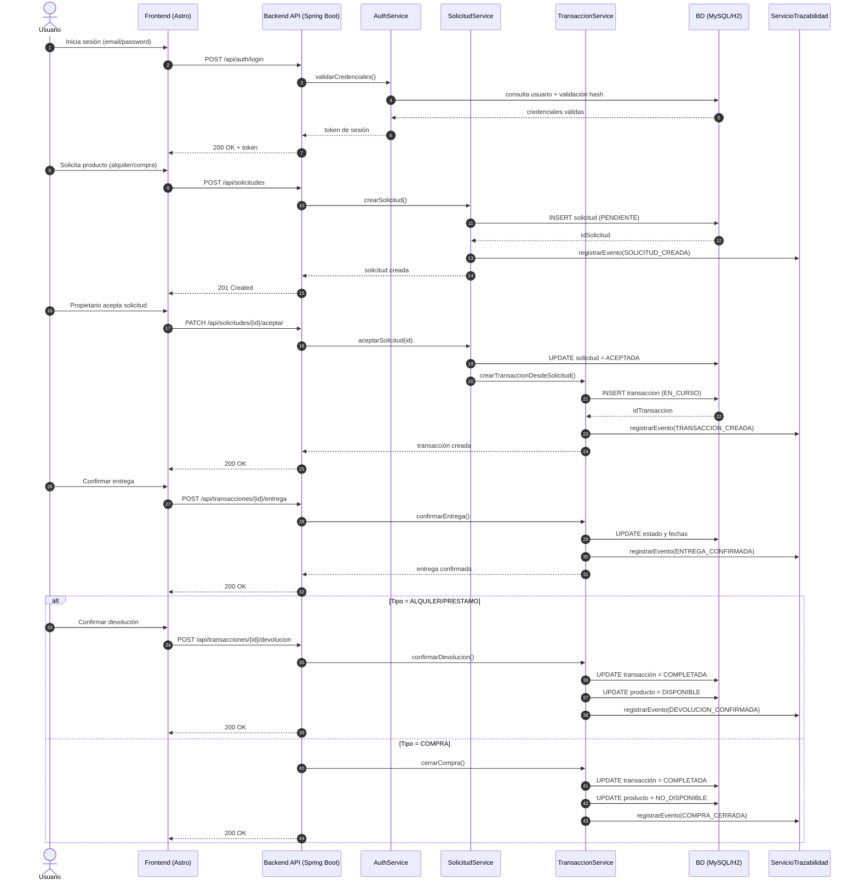

# 5. Sprint 1 — Estado de avance

## 5.1 INCORPORACIONES

Durante el Sprint 1 se han incorporado los elementos base del producto para disponer de una primera versión funcional (MVP técnico):

- **Estructura de proyecto fullstack** separada en `backend` (Spring Boot + Maven) y `frontend` (Astro).
- **Modelo de datos inicial** implementado en SQL y reflejado en entidades JPA:
  - `usuario`
  - `producto`
  - `solicitud`
  - `transaccion`
  - `foto_producto`
  - `reporte_usuario`
  - `reporte_producto`
- **Autenticación básica** con endpoints de registro e inicio de sesión:
  - `POST /api/auth/register`
  - `POST /api/auth/login`
- **Gestión de sesión básica** mediante token de sesión para identificar al usuario autenticado.
- **Módulo de perfil (`/api/me`)** para consultar datos del usuario autenticado y gestionar sus productos iniciales:
  - `GET /api/me`
  - `GET /api/me/productos`
  - `POST /api/me/productos`
- **CRUDs de base del dominio** en backend para usuarios, productos, solicitudes, transacciones y reportes.
- **Interfaz inicial en frontend** con páginas de autenticación y perfil:
  - Registro/login (`/auth`, `/login`)
  - Perfil y publicación básica de productos (`/profile`)
- **Carga de datos semilla para desarrollo** en entorno local (H2) para facilitar pruebas funcionales rápidas.

> Resultado del Sprint 1: plataforma con base técnica operativa, autenticación funcional y primer flujo end-to-end de usuario autenticado + gestión inicial de productos.

## 5.2 METODOLOGIA DE TRABAJO

La metodología aplicada en el Sprint 1 se ha basado en **SCRUM + Git Flow + Azure DevOps**:

- **Planificación por sprints** con backlog priorizado por historias de usuario.
- **Gestión del trabajo en Azure DevOps Boards**, con trazabilidad de tareas, responsables y estimaciones.
- **Flujo Git Flow**:
  - Rama estable: `main`
  - Rama de integración: `develop`
  - Ramas de trabajo: `feature/*`, `bugfix/*`, `hotfix/*`
- **Trabajo con Pull Requests** para revisión de código antes de integrar cambios.
- **Validación continua** con ejecución local de pruebas y pipeline de integración para asegurar compilación y calidad mínima.
- **Seguimiento de avance** mediante estados de tarea y actualización de horas/estado durante el sprint.

Este enfoque ha permitido mantener control del alcance del Sprint 1, coordinación del equipo y una base sólida para los sprints siguientes.

## 5.3 PLANTILLA

Para la definición del backlog se ha utilizado una **plantilla estándar de Historia de Usuario** orientada a valor de negocio y verificabilidad:

### Estructura de Historia de Usuario

- **Formato narrativo**:
  - Como `[tipo de usuario]`
  - Quiero `[acción]`
  - Para `[beneficio]`
- **Metadatos mínimos**:
  - ID (`HU-XXX`)
  - Tipo de Work Item (`User Story`)
  - Épica
  - Sprint
  - Prioridad
  - Story Points
  - Responsable
  - Tags
- **Criterios de aceptación** en formato verificable (estilo Gherkin).
- **Subtareas técnicas** asociadas (`T-XXX`) para backend, frontend, testing y calidad.
- **Dependencias** (qué bloquea y de qué depende).
- **Definición de Done** (código, testing, validación funcional e integración).

### Plantilla base utilizada

```text
ID: HU-XXX
Título: [Historia orientada a valor]

Como [rol]
Quiero [necesidad]
Para [beneficio]

Criterios de aceptación:
- Escenario 1...
- Escenario 2...

Tareas técnicas hijas:
- T-XXX ...
- T-YYY ...

Dependencias:
- ...

Definition of Done:
- Código implementado
- Pruebas ejecutadas
- PR aprobado
```

## 5.4 DIAGRAMAS

Como parte del Sprint 1, se han consolidado los diagramas de soporte técnico para alinear diseño, implementación y base de datos.

### 5.4.1 Diagrama MER



Este diagrama MER representa la estructura lógica de datos del Sprint 1. Identifica las entidades principales del dominio (usuarios, productos, solicitudes, transacciones, fotos y reportes), sus atributos clave y las cardinalidades entre ellas. Su función es asegurar la coherencia entre requisitos funcionales y persistencia, definiendo con claridad qué información se almacena, cómo se relaciona y qué restricciones de integridad deben cumplirse.

> Nota: en el modelo SQL real existen restricciones de unicidad adicionales (correo, teléfono, dni y `id_solicitud` en transacción).

### 5.4.2 Diagrama de clases



Este diagrama de clases muestra la vista orientada a objetos del modelo implementado en backend. Refleja las clases de dominio y sus atributos según las entidades JPA, así como las asociaciones funcionales entre ellas. Se utiliza para mantener la trazabilidad diseño-código, comprobando que la estructura del software respeta el modelo de negocio definido en análisis y en base de datos.

### 5.4.3 Diagrama de componentes



Este diagrama de componentes describe la arquitectura funcional del sistema y la responsabilidad de cada bloque. Se observa el flujo principal desde el usuario (frontend Astro) hasta la API Spring Boot, la descomposición en controladores/servicios y la capa de repositorios conectada a la base de datos. También incorpora el componente de trazabilidad para registrar eventos operativos, lo que facilita auditoría técnica y seguimiento de incidencias.

### 5.4.4 Diagrama de estados (trazabilidad de acciones)



Este diagrama de estados modela el ciclo de vida de una operación iniciada por el usuario, desde la publicación y solicitud hasta su cierre por compra o devolución. Define transiciones explícitas para aceptar/rechazar, quedar para entrega, confirmar entrega y finalizar la transacción, incluyendo cancelaciones. Como apoyo a trazabilidad, cada transición relevante se asocia a eventos registrables (actor, fecha e identificador de solicitud/transacción), permitiendo reconstruir qué ocurrió, cuándo y por quién.

### 5.4.5 Diagrama de secuencia (flujo principal de operación)



Este diagrama de secuencia representa, en orden temporal, la interacción entre actor, interfaz, servicios de negocio y base de datos durante el flujo principal de una operación en UFV Share. El diagrama permite verificar la trazabilidad entre acciones del usuario y efectos técnicos (creación/actualización de solicitud y transacción), incorporando además el registro de eventos de auditoría en cada hito relevante. De este modo, se documenta no solo qué funcionalidad se ejecuta, sino también cómo se propaga internamente cada acción hasta su cierre por compra o devolución.

---

### Nota de alcance del Sprint 1

Este documento refleja el avance técnico ya implementado y validado en repositorio al cierre del Sprint 1. Los módulos avanzados previstos para siguientes sprints (mensajería, historial ampliado, refinamientos UX y hardening de seguridad) quedan fuera de este apartado.
