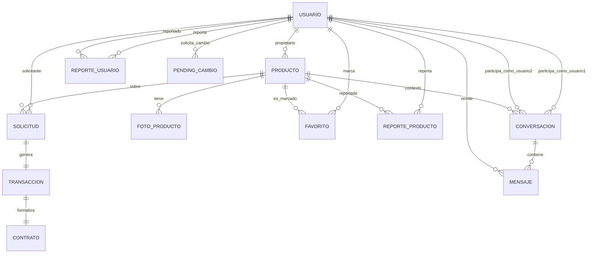

# Modelo Entidad-Relacional Actual (Backend)

Fecha: 2026-04-04
Fuente: entidades JPA en `backend/src/main/java`

## 1) Entidades persistentes

| Entidad | Tabla | PK | Campos clave |
|---|---|---|---|
| Usuario | usuario | id_usuario | correo (unique), telefono (unique), dni (unique), es_admin |
| Producto | producto | id_producto | id_propietario, categoria, tipo_transaccion, estado_producto, precio |
| FotoProducto | foto_producto | id_foto | id_producto, url_foto, es_principal |
| Solicitud | solicitud | id_solicitud | id_producto, id_solicitante, tipo_transaccion, estado_solicitud, fechas |
| Transaccion | transaccion | id_transaccion | id_solicitud (unique), estado_transaccion, fecha_inicio_real, fecha_fin_real |
| Contrato | contrato | id_contrato | id_transaccion (unique), id_producto, id_propietario, id_arrendatario, acepta_terminos, estado_contrato |
| Favorito | favorito | id_favorito | id_usuario, id_producto, fecha_creacion |
| Conversacion | conversacion | id_conversacion | id_usuario1, id_usuario2, id_producto, ultimo_mensaje |
| Mensaje | mensaje | id_mensaje | id_conversacion, id_remitente, contenido, leido |
| ReporteUsuario | reporte_usuario | id_reporte | id_usuario_reportante, id_usuario_reportado, motivo, estado_reporte |
| ReporteProducto | reporte_producto | id_reporte | id_usuario_reportante, id_producto_reportado, motivo, estado_reporte |
| Session | sessions | token | email |
| PendingCambio | pending_cambio | id | id_usuario, campo, valor_nuevo, token (unique), expiracion, usado |

Notas:
- `auth.User` NO es entidad JPA (es un `record` no persistente).
- La mayoria de relaciones se guardan como IDs (`Long`) y se resuelven en servicios.
- Las relaciones JPA explicitas (`@ManyToOne`) estan en chat: `Conversacion` y `Mensaje`.

## 2) Relaciones y cardinalidades

### Relaciones por IDs (implícitas)

- Usuario (1) -> (N) Producto por `producto.id_propietario`
- Usuario (1) -> (N) Solicitud por `solicitud.id_solicitante`
- Producto (1) -> (N) Solicitud por `solicitud.id_producto`
- Solicitud (1) -> (1) Transaccion por `transaccion.id_solicitud` (UNIQUE)
- Transaccion (1) -> (1) Contrato por `contrato.id_transaccion` (UNIQUE)
- Producto (1) -> (N) Contrato por `contrato.id_producto`
- Usuario (1) -> (N) Contrato por `contrato.id_propietario`
- Usuario (1) -> (N) Contrato por `contrato.id_arrendatario`
- Producto (1) -> (N) FotoProducto por `foto_producto.id_producto`
- Usuario (1) -> (N) Favorito por `favorito.id_usuario`
- Producto (1) -> (N) Favorito por `favorito.id_producto`
- Usuario (1) -> (N) ReporteUsuario por `id_usuario_reportante`
- Usuario (1) -> (N) ReporteUsuario por `id_usuario_reportado`
- Usuario (1) -> (N) ReporteProducto por `id_usuario_reportante`
- Producto (1) -> (N) ReporteProducto por `id_producto_reportado`
- Usuario (1) -> (N) PendingCambio por `pending_cambio.id_usuario`

### Relaciones JPA explicitas (chat)

- Usuario (1) -> (N) Conversacion por `conversacion.id_usuario1`
- Usuario (1) -> (N) Conversacion por `conversacion.id_usuario2`
- Producto (1) -> (N) Conversacion por `conversacion.id_producto`
- Conversacion (1) -> (N) Mensaje por `mensaje.id_conversacion`
- Usuario (1) -> (N) Mensaje por `mensaje.id_remitente`

## 3) Restricciones importantes

- `usuario.correo` UNIQUE
- `usuario.telefono` UNIQUE
- `usuario.dni` UNIQUE
- `transaccion.id_solicitud` UNIQUE (garantiza 1 transaccion por solicitud)
- `contrato.id_transaccion` UNIQUE (garantiza 1 contrato por transaccion)
- `favorito` UNIQUE compuesto (`id_usuario`, `id_producto`)
- `pending_cambio.token` UNIQUE

## 4) Enums del dominio

- `TipoTransaccion`: PRESTAMO, ALQUILER, VENTA
- `EstadoProducto`: DISPONIBLE, RESERVADO, ALQUILADO, VENDIDO, NO_DISPONIBLE
- `CondicionProducto`: NUEVO, COMO_NUEVO, BUENO, ACEPTABLE, DETERIORADO
- `CategoriaProducto`: ELECTRONICA, LIBROS, DEPORTE, HOGAR, OTROS
- `EstadoSolicitud`: PENDIENTE, ACEPTADA, RECHAZADA, CANCELADA
- `EstadoTransaccion`: EN_CURSO, COMPLETADA, CANCELADA, NO_DEVUELTA
- `EstadoContrato`: PENDIENTE_FIRMA, ACTIVO, FINALIZADO, CANCELADO
- `EstadoReporte`: ABIERTO, EN_REVISION, CERRADO

## 5) Diagrama ER (vista logica)

## 6) Observaciones de implementacion

- Este modelo mezcla relaciones explicitas JPA (chat) con relaciones por IDs en el resto del dominio.
- El enfoque por IDs simplifica entidades pero mueve la integridad relacional a servicios/repositorios.
- Si se quiere mayor robustez a nivel BD, conviene definir FKs explicitas con migraciones SQL.
