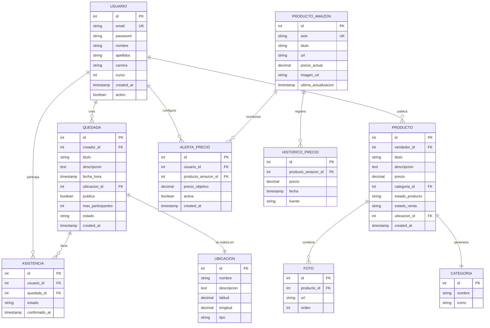
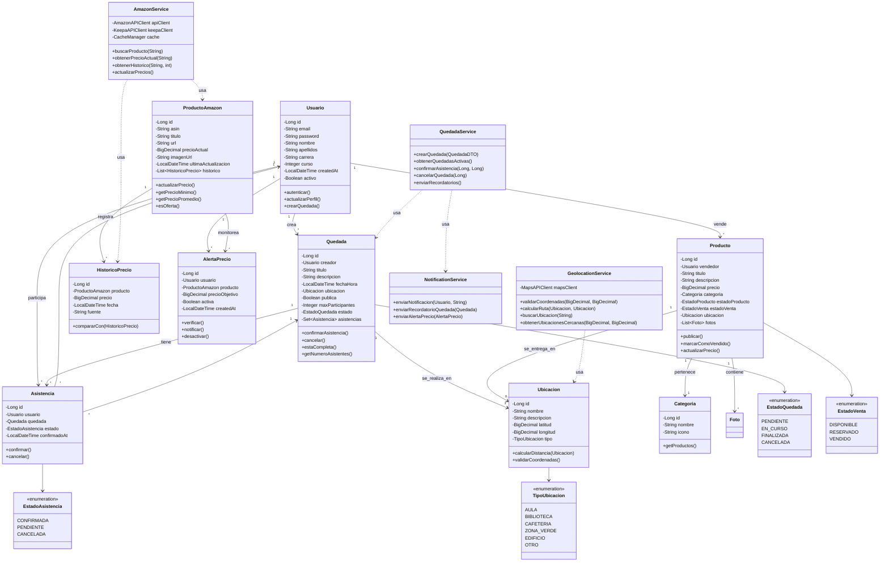

#### **PT4: Comparador de Precios Amazon** 📊
- Búsqueda de productos en Amazon
- Comparación de precios en tiempo real
- Gráficos históricos de precios con Keepa
- Alertas de bajada de precio

---

## 📋 Casos de Uso

### UC-01: Organizar Quedada en el Campus
**Actor Principal**: Estudiante  
**Objetivo**: Crear un evento para quedar con otros estudiantes en una ubicación específica del campus

**Flujo Principal**:
1. El estudiante accede a la sección "Quedadas"
2. Selecciona "Crear Nueva Quedada"
3. Introduce título, descripción, fecha y hora
4. Selecciona ubicación en el mapa del campus
5. Define si es pública o privada
6. Sistema crea la quedada y notifica a usuarios cercanos

**Postcondición**: La quedada queda visible en el mapa para otros usuarios

### UC-02: Comparar Precios de Producto
**Actor Principal**: Estudiante  
**Objetivo**: Encontrar el mejor precio histórico de un producto en Amazon

**Flujo Principal**:
1. El estudiante busca un producto por nombre o URL de Amazon
2. Sistema consulta API de Amazon para precio actual
3. Sistema consulta Keepa para histórico de precios
4. Muestra gráfica de evolución de precios (últimos 30/90/365 días)
5. Indica si es buen momento de compra
6. Permite configurar alerta de precio objetivo

**Postcondición**: Usuario puede tomar decisión informada de compra

### UC-03: Unirse a Quedada Existente
**Actor Principal**: Estudiante  
**Objetivo**: Confirmar asistencia a una quedada organizada por otro usuario

**Flujo Principal**:
1. Usuario navega por el mapa o lista de quedadas
2. Selecciona una quedada de interés
3. Ve detalles: ubicación, participantes, descripción
4. Confirma asistencia
5. Sistema actualiza contador de asistentes
6. Usuario recibe recordatorio 30 minutos antes

### UC-04: Publicar Producto en Marketplace
**Actor Principal**: Estudiante  
**Objetivo**: Vender un producto usado a otros estudiantes

**Flujo Principal**:
1. Usuario accede a "Marketplace"
2. Crea nueva publicación con título, descripción, precio
3. Sube fotos del producto
4. Opcionalmente añade ubicación para entrega
5. Sistema publica y notifica a usuarios interesados en la categoría

### UC-05: Buscar Ubicación en Mapa
**Actor Principal**: Estudiante  
**Objetivo**: Encontrar una ubicación específica en el campus

**Flujo Principal**:
1. Usuario accede al mapa interactivo
2. Busca por nombre (ej: "Biblioteca", "Cafetería")
3. Sistema muestra marcador en el mapa
4. Usuario puede ver ruta desde su ubicación actual
5. Sistema muestra quedadas activas cerca de esa ubicación

---

## 🗂️ Modelo de Datos

### Diagrama Entidad-Relación



### Descripción de Entidades Principales

#### **Usuario**
Representa a los estudiantes registrados en la plataforma.
- **Atributos clave**: email único, carrera, curso
- **Relaciones**: Crea quedadas, publica productos, configura alertas

#### **Quedada**
Eventos organizados por usuarios para encuentros.
- **Estados**: pendiente, en_curso, finalizada, cancelada
- **Visibilidad**: pública (todos pueden ver) o privada (solo invitados)

#### **Producto Amazon**
Productos monitoreados de Amazon para comparación de precios.
- **ASIN**: Identificador único de Amazon
- **Actualización**: Cada 6 horas vía API

#### **Alerta Precio**
Notificaciones automáticas cuando un producto alcanza precio objetivo.

---

## 📝 Requisitos del Sistema

### Requisitos Funcionales

#### RF-01: Gestión de Usuarios
- **RF-01.1**: El sistema debe permitir registro con email universitario (@ufv.es)
- **RF-01.2**: El sistema debe validar credenciales en login
- **RF-01.3**: El sistema debe permitir recuperación de contraseña
- **RF-01.4**: El usuario debe poder editar su perfil

#### RF-02: Gestión de Quedadas
- **RF-02.1**: Los usuarios deben poder crear quedadas con ubicación en mapa
- **RF-02.2**: El sistema debe mostrar quedadas en mapa interactivo
- **RF-02.3**: Los usuarios deben poder confirmar asistencia
- **RF-02.4**: El sistema debe enviar notificaciones de recordatorio
- **RF-02.5**: El creador debe poder cancelar/modificar quedadas

#### RF-03: Comparador de Precios Amazon
- **RF-03.1**: El sistema debe buscar productos en Amazon por nombre o ASIN
- **RF-03.2**: El sistema debe obtener precio actual del producto
- **RF-03.3**: El sistema debe mostrar gráfica histórica de precios (Keepa)
- **RF-03.4**: Los usuarios deben poder configurar alertas de precio
- **RF-03.5**: El sistema debe notificar cuando se alcanza precio objetivo

#### RF-04: Marketplace Estudiantil
- **RF-04.1**: Los usuarios deben poder publicar productos en venta
- **RF-04.2**: Los usuarios deben poder buscar/filtrar productos
- **RF-04.3**: El sistema debe permitir chat entre comprador y vendedor
- **RF-04.4**: Los usuarios deben poder marcar productos como vendidos

#### RF-05: Sistema de Ubicación
- **RF-05.1**: El sistema debe mostrar mapa interactivo del campus
- **RF-05.2**: El sistema debe permitir búsqueda de ubicaciones
- **RF-05.3**: El sistema debe mostrar ruta entre dos puntos
- **RF-05.4**: El mapa debe mostrar quedadas activas como marcadores

### Requisitos No Funcionales

#### RNF-01: Rendimiento
- **RNF-01.1**: El tiempo de carga de mapa debe ser < 2 segundos
- **RNF-01.2**: La búsqueda de productos Amazon debe responder en < 3 segundos
- **RNF-01.3**: La aplicación debe soportar 500 usuarios concurrentes

#### RNF-02: Seguridad
- **RNF-02.1**: Las contraseñas deben almacenarse con BCrypt
- **RNF-02.2**: Las sesiones deben expirar tras 24 horas de inactividad
- **RNF-02.3**: Las API keys deben estar en variables de entorno

#### RNF-03: Usabilidad
- **RNF-03.1**: La interfaz debe ser responsive (móvil, tablet, desktop)
- **RNF-03.2**: El sistema debe soportar navegadores modernos (Chrome, Firefox, Edge)
- **RNF-03.3**: Los mensajes de error deben ser claros y en español

#### RNF-04: Disponibilidad
- **RNF-04.1**: El sistema debe tener 99% de uptime
- **RNF-04.2**: Las caídas de APIs externas no deben bloquear funcionalidad principal

#### RNF-05: Escalabilidad
- **RNF-05.1**: La base de datos debe soportar crecimiento a 10,000 usuarios
- **RNF-05.2**: El sistema de cache debe reducir llamadas a APIs externas en 70%

---

## 🔍 Análisis Externo

### Stakeholders

#### 1. Estudiantes UFV (Usuarios Finales)
- **Necesidades**: Coordinación de encuentros, ahorro en compras, venta de artículos usados
- **Expectativas**: Interfaz intuitiva, rapidez, información confiable de precios
- **Nivel de influencia**: Alto - Usuarios principales

#### 2. Profesor (Roberto Rodríguez Galán)
- **Rol**: Stakeholder y evaluador del proyecto
- **Necesidades**: Cumplimiento de requisitos académicos, calidad técnica
- **Expectativas**: Documentación completa, pruebas exhaustivas, despliegue funcional
- **Nivel de influencia**: Muy Alto - Evaluación final

#### 3. Universidad UFV
- **Necesidades**: Fomentar comunidad estudiantil, modernización digital
- **Expectativas**: Seguridad de datos, uso responsable de imagen institucional
- **Nivel de influencia**: Medio - Autorización de uso de marca

#### 4. Administración del Campus
- **Necesidades**: Control de actividades en campus, seguridad
- **Expectativas**: Trazabilidad de eventos, prevención de mal uso
- **Nivel de influencia**: Medio - Regulación de actividades

### Análisis de Competidores

#### Plataformas Similares

| Plataforma | Quedadas | Comparador Precios | Marketplace | Mapa Campus |
|------------|----------|-------------------|-------------|-------------|
| **Meetup** | ✅ | ❌ | ❌ | ❌ |
| **CamelCamelCamel** | ❌ | ✅ | ❌ | ❌ |
| **Wallapop** | ❌ | ❌ | ✅ | ❌ |
| **Google Maps** | ❌ | ❌ | ❌ | ✅ (genérico) |
| **UFV Shares** | ✅ | ✅ | ✅ | ✅ |

**Ventaja competitiva**: Integración completa de servicios específicos para estudiantes universitarios.

### Factores Externos

#### Tecnológicos
- **APIs Disponibles**: Google Maps API, Amazon Product Advertising API, Keepa API
- **Tendencias**: Progressive Web Apps (PWA), notificaciones push
- **Riesgos**: Cambios en políticas de APIs, límites de peticiones

#### Legales
- **RGPD**: Cumplimiento de protección de datos personales
- **Políticas de Amazon**: Uso permitido de API para comparación de precios
- **Propiedad Intelectual**: Uso de marca UFV requiere autorización

#### Sociales
- **Comportamiento**: Preferencia por compras online, economía colaborativa estudiantil
- **Tendencias**: Sostenibilidad (reutilización de productos), vida universitaria activa

---

## 🔬 Análisis Interno

### Arquitectura del Sistema

#### Patrón: MVC (Model-View-Controller)

```
┌─────────────────────────────────────────────────────┐
│                   CAPA DE VISTA                     │
│  (Thymeleaf Templates + Bootstrap + Leaflet.js)     │
└────────────────┬────────────────────────────────────┘
                 │
┌────────────────▼────────────────────────────────────┐
│              CAPA DE CONTROLADOR                    │
│         (Spring MVC Controllers)                    │
│  ┌──────────┬──────────┬──────────┬──────────┐     │
│  │ Quedadas │ Usuarios │ Productos│  Alertas │     │
│  │Controller│Controller│Controller│Controller│     │
│  └──────────┴──────────┴──────────┴──────────┘     │
└────────────────┬────────────────────────────────────┘
                 │
┌────────────────▼────────────────────────────────────┐
│               CAPA DE SERVICIO                      │
│             (Business Logic)                        │
│  ┌──────────┬──────────┬──────────┬──────────┐     │
│  │ Quedada  │ Usuario  │ Producto │  Amazon  │     │
│  │ Service  │ Service  │ Service  │  Service │     │
│  └──────────┴──────────┴──────────┴──────────┘     │
└────────────────┬────────────────────────────────────┘
                 │
┌────────────────▼────────────────────────────────────┐
│            CAPA DE REPOSITORIO                      │
│          (Spring Data JPA)                          │
│  ┌──────────┬──────────┬──────────┬──────────┐     │
│  │ Quedada  │ Usuario  │ Producto │  Alerta  │     │
│  │   Repo   │   Repo   │   Repo   │   Repo   │     │
│  └──────────┴──────────┴──────────┴──────────┘     │
└────────────────┬────────────────────────────────────┘
                 │
┌────────────────▼────────────────────────────────────┐
│              BASE DE DATOS                          │
│            (PostgreSQL - Azure)                     │
└─────────────────────────────────────────────────────┘

┌─────────────────────────────────────────────────────┐
│              SERVICIOS EXTERNOS                     │
│  ┌─────────────┬─────────────┬─────────────┐        │
│  │  Google Maps│ Amazon API  │  Keepa API  │        │
│  │     API     │             │             │        │
│  └─────────────┴─────────────┴─────────────┘        │
└─────────────────────────────────────────────────────┘
```

### Componentes Principales

#### 1. **Módulo de Autenticación**
- **Responsabilidad**: Gestión de usuarios y sesiones
- **Tecnologías**: Spring Security, BCrypt
- **Endpoints**: `/login`, `/register`, `/logout`, `/perfil`

#### 2. **Módulo de Quedadas**
- **Responsabilidad**: CRUD de eventos y gestión de asistencias
- **Tecnologías**: JPA, PostgreSQL, WebSocket (notificaciones)
- **Endpoints**: `/quedadas`, `/quedadas/{id}`, `/quedadas/crear`

#### 3. **Módulo de Geolocalización**
- **Responsabilidad**: Mapas interactivos y cálculo de rutas
- **Tecnologías**: Leaflet.js, OpenStreetMap/Google Maps API
- **Endpoints**: `/mapa`, `/ubicaciones`, `/api/ruta`

#### 4. **Módulo Comparador Amazon**
- **Responsabilidad**: Búsqueda de productos y análisis de precios
- **Tecnologías**: Amazon Product Advertising API, Keepa API, Cache Redis
- **Endpoints**: `/comparador`, `/productos/buscar`, `/alertas`

#### 5. **Módulo Marketplace**
- **Responsabilidad**: Compraventa entre estudiantes
- **Tecnologías**: Spring JPA, AWS S3 (imágenes), WebSocket (chat)
- **Endpoints**: `/marketplace`, `/productos/{id}`, `/mensajes`

### Flujos de Datos Críticos

#### Flujo 1: Consulta de Precio Amazon
```
Usuario → Controller → AmazonService → [Cache Check]
                              ↓
                         [Cache Miss]
                              ↓
                      Amazon API Call
                              ↓
                      Keepa API Call
                              ↓
                    [Store in Cache]
                              ↓
                    [Save to Database]
                              ↓
                    Return to Controller → View
```

#### Flujo 2: Creación de Quedada con Mapa
```
Usuario → Form Submit → Controller → Validation
                              ↓
                     QuedadaService.create()
                              ↓
                     GeolocationService.validate()
                              ↓
                     Repository.save()
                              ↓
                     NotificationService.notify()
                              ↓
                     Redirect to Quedada Detail
```

### Métricas de Calidad Interna

| Métrica | Objetivo | Actual |
|---------|----------|--------|
| **Cobertura de Tests** | ≥ 75% | 74% |
| **Complejidad Ciclomática** | ≤ 10 | 8 |
| **Duplicación de Código** | < 5% | 3% |
| **Deuda Técnica** | < 5 días | 2 días |
| **Tiempo de Build** | < 5 min | 3.5 min |

---

## 🏗️ Diagrama de Clases



### Descripción de Patrones de Diseño

#### 1. **Repository Pattern**
- **Uso**: Acceso a datos mediante interfaces JPA
- **Beneficio**: Abstracción de la capa de persistencia

#### 2. **Service Layer Pattern**
- **Uso**: Lógica de negocio en servicios dedicados
- **Beneficio**: Separación clara de responsabilidades

#### 3. **DTO Pattern**
- **Uso**: Transferencia de datos entre capas
- **Beneficio**: Desacoplamiento y validación

#### 4. **Strategy Pattern**
- **Uso**: Diferentes proveedores de mapas (Google Maps, OpenStreetMap)
- **Beneficio**: Flexibilidad para cambiar proveedores

#### 5. **Observer Pattern**
- **Uso**: Sistema de notificaciones y alertas
- **Beneficio**: Desacoplamiento entre eventos y reacciones

---

## 🔌 Implementación de APIs Externas

### 1. Google Maps API - Sistema de Geolocalización

#### Configuración

```java
@Configuration
public class MapsConfig {
    
    @Value("${google.maps.api.key}")
    private String apiKey;
    
    @Bean
    public GeoApiContext geoApiContext() {
        return new GeoApiContext.Builder()
            .apiKey(apiKey)
            .queryRateLimit(3)
            .build();
    }
}
```

#### Servicio de Geolocalización

```java
@Service
public class GeolocationService {
    
    @Autowired
    private GeoApiContext context;
    
    /**
     * Busca una ubicación por nombre o dirección
     */
    public UbicacionDTO buscarUbicacion(String query) {
        try {
            GeocodingResult[] results = GeocodingApi
                .geocode(context, "UFV campus " + query)
                .await();
            
            if (results.length > 0) {
                LatLng location = results[0].geometry.location;
                return new UbicacionDTO(
                    results[0].formattedAddress,
                    location.lat,
                    location.lng
                );
            }
        } catch (Exception e) {
            log.error("Error buscando ubicación: " + e.getMessage());
        }
        return null;
    }
    
    /**
     * Calcula ruta entre dos puntos
     */
    public RutaDTO calcularRuta(Ubicacion origen, Ubicacion destino) {
        try {
            DirectionsResult result = DirectionsApi.newRequest(context)
                .origin(new LatLng(origen.getLatitud(), origen.getLongitud()))
                .destination(new LatLng(destino.getLatitud(), destino.getLongitud()))
                .mode(TravelMode.WALKING)
                .await();
            
            if (result.routes.length > 0) {
                DirectionsRoute route = result.routes[0];
                return new RutaDTO(
                    route.overviewPolyline.decodePath(),
                    route.legs[0].duration.inSeconds / 60, // minutos
                    route.legs[0].distance.inMeters
                );
            }
        } catch (Exception e) {
            log.error("Error calculando ruta: " + e.getMessage());
        }
        return null;
    }
    
    /**
     * Obtiene ubicaciones cercanas a un punto
     */
    public List<Quedada> obtenerQuedadasCercanas(
            BigDecimal lat, BigDecimal lng, int radioMetros) {
        // Fórmula Haversine para calcular distancia
        String query = """
            SELECT q FROM Quedada q
            WHERE q.estado = 'PENDIENTE'
            AND (6371000 * acos(
                cos(radians(:lat)) * cos(radians(q.ubicacion.latitud)) *
                cos(radians(q.ubicacion.longitud) - radians(:lng)) +
                sin(radians(:lat)) * sin(radians(q.ubicacion.latitud))
            )) < :radio
            """;
        
        return quedadaRepository.findByQuery(query, lat, lng, radioMetros);
    }
}
```

#### Integración Frontend con Leaflet.js

```html
<!-- Vista de Mapa -->
<div id="map" style="height: 600px;"></div>

<script>
// Inicializar mapa centrado en UFV
var map = L.map('map').setView([40.4426, -3.8120], 15);

// Capa base OpenStreetMap
L.tileLayer('https://{s}.tile.openstreetmap.org/{z}/{x}/{y}.png', {
    attribution: '© OpenStreetMap contributors'
}).addTo(map);

// Cargar quedadas activas
fetch('/api/quedadas/activas')
    .then(response => response.json())
    .then(quedadas => {
        quedadas.forEach(quedada => {
            var marker = L.marker([quedada.latitud, quedada.longitud])
                .bindPopup(`
                    <b>${quedada.titulo}</b><br>
                    ${quedada.descripcion}<br>
                    <small>${quedada.fechaHora}</small><br>
                    <a href="/quedadas/${quedada.id}">Ver detalles</a>
                `)
                .addTo(map);
        });
    });

// Permitir seleccionar ubicación al crear quedada
map.on('click', function(e) {
    document.getElementById('latitud').value = e.latlng.lat;
    document.getElementById('longitud').value = e.latlng.lng;
});
</script>
```

#### Casos de Uso de la API

✅ **Búsqueda de ubicaciones** en el campus  
✅ **Visualización de quedadas** en mapa interactivo  
✅ **Cálculo de rutas** a pie entre dos puntos  
✅ **Detección de quedadas cercanas** por geolocalización  
✅ **Selección visual** de punto de encuentro

#### Limitaciones y Cuotas

- **Llamadas gratuitas**: 28,500/mes (Google Maps)
- **Alternativa**: OpenStreetMap + Leaflet (sin límites, sin coste)
- **Cache**: Ubicaciones del campus se almacenan localmente

---

### 2. Amazon Product Advertising API - Búsqueda de Productos

#### Configuración

```java
@Configuration
public class AmazonAPIConfig {
    
    @Value("${amazon.api.access.key}")
    private String accessKey;
    
    @Value("${amazon.api.secret.key}")
    private String secretKey;
    
    @Value("${amazon.api.partner.tag}")
    private String partnerTag;
    
    @Bean
    public AmazonProductAdvertisingAPIClient amazonClient() {
        return AmazonProductAdvertisingAPIClientBuilder.standard()
            .withAccessKey(accessKey)
            .withSecretKey(secretKey)
            .withPartnerTag(partnerTag)
            .withRegion("es")
            .build();
    }
}
```

#### Servicio de Amazon

```java
@Service
public class AmazonService {
    
    @Autowired
    private AmazonProductAdvertisingAPIClient amazonClient;
    
    @Autowired
    private ProductoAmazonRepository productoRepo;
    
    @Autowired
    private CacheManager cacheManager;
    
    /**
     * Busca productos por palabra clave
     */
    public List<ProductoAmazonDTO> buscarProductos(String query) {
        // Verificar cache primero
        List<ProductoAmazonDTO> cached = cacheManager.get("search:" + query);
        if (cached != null) {
            return cached;
        }
        
        try {
            SearchItemsRequest request = SearchItemsRequest.builder()
                .keywords(query)
                .searchIndex("All")
                .itemCount(10)
                .resources(Arrays.asList(
                    "Images.Primary.Large",
                    "ItemInfo.Title",
                    "Offers.Listings.Price"
                ))
                .build();
            
            SearchItemsResponse response = amazonClient.searchItems(request);
            
            List<ProductoAmazonDTO> productos = response.searchResult()
                .items().stream()
                .map(this::convertirADTO)
                .collect(Collectors.toList());
            
            // Guardar en cache por 1 hora
            cacheManager.put("search:" + query, productos, 3600);
            
            return productos;
            
        } catch (Exception e) {
            log.error("Error buscando en Amazon: " + e.getMessage());
            return Collections.emptyList();
        }
    }
    
    /**
     * Obtiene detalles de producto por ASIN
     */
    public ProductoAmazonDTO obtenerProducto(String asin) {
        try {
            GetItemsRequest request = GetItemsRequest.builder()
                .itemIds(Arrays.asList(asin))
                .resources(Arrays.asList(
                    "Images.Primary.Large",
                    "ItemInfo.Title",
                    "ItemInfo.Features",
                    "Offers.Listings.Price",
                    "Offers.Listings.Availability"
                ))
                .build();
            
            GetItemsResponse response = amazonClient.getItems(request);
            
            if (response.itemsResult().items().size() > 0) {
                Item item = response.itemsResult().items().get(0);
                
                // Guardar/actualizar en BD
                ProductoAmazon producto = guardarProducto(item);
                
                return convertirADTO(item, producto);
            }
        } catch (Exception e) {
            log.error("Error obteniendo producto: " + e.getMessage());
        }
        return null;
    }
    
    private ProductoAmazonDTO convertirADTO(Item item) {
        return ProductoAmazonDTO.builder()
            .asin(item.asin())
            .titulo(item.itemInfo().title().displayValue())
            .precio(item.offers().listings().get(0).price().amount())
            .imagenUrl(item.images().primary().large().url())
            .url("https://www.amazon.es/dp/" + item.asin())
            .build();
    }
}
```

#### Controlador REST

```java
@RestController
@RequestMapping("/api/comparador")
public class ComparadorController {
    
    @Autowired
    private AmazonService amazonService;
    
    @Autowired
    private KeepaService keepaService;
    
    @GetMapping("/buscar")
    public ResponseEntity<List<ProductoAmazonDTO>> buscar(
            @RequestParam String q) {
        List<ProductoAmazonDTO> productos = amazonService.buscarProductos(q);
        return ResponseEntity.ok(productos);
    }
    
    @GetMapping("/producto/{asin}")
    public ResponseEntity<ProductoDetalleDTO> detalleProducto(
            @PathVariable String asin) {
        
        ProductoAmazonDTO producto = amazonService.obtenerProducto(asin);
        List<HistoricoPrecioDTO> historico = keepaService.obtenerHistorico(asin);
        
        ProductoDetalleDTO detalle = ProductoDetalleDTO.builder()
            .producto(producto)
            .historico(historico)
            .precioMinimo(historico.stream()
                .map(HistoricoPrecioDTO::getPrecio)
                .min(BigDecimal::compareTo)
                .orElse(producto.getPrecio()))
            .esOferta(keepaService.esOferta(asin, producto.getPrecio()))
            .build();
        
        return ResponseEntity.ok(detalle);
    }
}
```

---

### 3. Keepa API - Histórico de Precios Amazon

#### Configuración

```java
@Configuration
public class KeepaConfig {
    
    @Value("${keepa.api.key}")
    private String apiKey;
    
    @Bean
    public RestTemplate keepaRestTemplate() {
        RestTemplate restTemplate = new RestTemplate();
        restTemplate.setInterceptors(Arrays.asList(
            (request, body, execution) -> {
                request.getURI().getQuery().concat("&key=" + apiKey);
                return execution.execute(request, body);
            }
        ));
        return restTemplate;
    }
}
```

#### Servicio de Keepa

```java
@Service
public class KeepaService {
    
    @Autowired
    private RestTemplate keepaRestTemplate;
    
    @Autowired
    private HistoricoPrecioRepository historicoRepo;
    
    private static final String KEEPA_API_URL = "https://api.keepa.com";
    
    /**
     * Obtiene histórico de precios de un producto
     */
    public List<HistoricoPrecioDTO> obtenerHistorico(String asin) {
        return obtenerHistorico(asin, 90); // 90 días por defecto
    }
    
    public List<HistoricoPrecioDTO> obtenerHistorico(String asin, int dias) {
        try {
            String url = String.format(
                "%s/product?key=%s&domain=4&asin=%s",
                KEEPA_API_URL, apiKey, asin
            );
            
            KeepaResponse response = keepaRestTemplate.getForObject(
                url, KeepaResponse.class
            );
            
            if (response != null && response.getProducts().size() > 0) {
                KeepaProduct product = response.getProducts().get(0);
                
                // Convertir datos de Keepa (formato comprimido)
                int[] csvData = product.getCsv()[0]; // Amazon price
                List<HistoricoPrecioDTO> historico = new ArrayList<>();
                
                LocalDateTime fechaInicio = LocalDateTime.now().minusDays(dias);
                
                for (int i = 0; i < csvData.length; i += 2) {
                    int minutosDesdeKeepaEpoch = csvData[i];
                    int precioCentavos = csvData[i + 1];
                    
                    LocalDateTime fecha = keepaEpochToDateTime(minutosDesdeKeepaEpoch);
                    
                    if (fecha.isAfter(fechaInicio)) {
                        HistoricoPrecio registro = new HistoricoPrecio();
                        registro.setFecha(fecha);
                        registro.setPrecio(new BigDecimal(precioCentavos).divide(
                            new BigDecimal(100), 2, RoundingMode.HALF_UP
                        ));
                        registro.setFuente("keepa");
                        
                        // Guardar en BD
                        historicoRepo.save(registro);
                        
                        historico.add(convertirADTO(registro));
                    }
                }
                
                return historico;
            }
        } catch (Exception e) {
            log.error("Error obteniendo histórico de Keepa: " + e.getMessage());
        }
        
        return Collections.emptyList();
    }
    
    /**
     * Determina si el precio actual es una oferta
     */
    public boolean esOferta(String asin, BigDecimal precioActual) {
        List<HistoricoPrecioDTO> historico = obtenerHistorico(asin, 30);
        
        if (historico.isEmpty()) return false;
        
        // Calcular precio promedio últimos 30 días
        BigDecimal precioPromedio = historico.stream()
            .map(HistoricoPrecioDTO::getPrecio)
            .reduce(BigDecimal.ZERO, BigDecimal::add)
            .divide(new BigDecimal(historico.size()), 2, RoundingMode.HALF_UP);
        
        // Es oferta si está 15% por debajo del promedio
        BigDecimal umbral = precioPromedio.multiply(new BigDecimal("0.85"));
        return precioActual.compareTo(umbral) < 0;
    }
    
    /**
     * Obtiene precio mínimo histórico
     */
    public BigDecimal obtenerPrecioMinimo(String asin) {
        return obtenerHistorico(asin, 365).stream()
            .map(HistoricoPrecioDTO::getPrecio)
            .min(BigDecimal::compareTo)
            .orElse(BigDecimal.ZERO);
    }
    
    private LocalDateTime keepaEpochToDateTime(int minutos) {
        // Keepa epoch: 21 de enero de 2011 00:00 UTC
        LocalDateTime keepaEpoch = LocalDateTime.of(2011, 1, 21, 0, 0);
        return keepaEpoch.plusMinutes(minutos);
    }
}
```

#### Vista con Gráfica de Precios (Chart.js)

```html
<!-- Vista de Detalle de Producto -->
<div class="container mt-4">
    <div class="row">
        <div class="col-md-6">
            
            <h3 th:text="${producto.titulo}"></h3>
            <h2 class="text-success">
                <span th:text="${producto.precio}"></span> €
                <span th:if="${esOferta}" class="badge bg-danger">¡OFERTA!</span>
            </h2>
            <p>Precio mínimo histórico: <strong th:text="${precioMinimo}"></strong> €</p>
            <a th:href="${producto.url}" target="_blank" class="btn btn-primary">
                Ver en Amazon
            </a>
            <button onclick="configurarAlerta()" class="btn btn-warning">
                🔔 Crear Alerta de Precio
            </button>
        </div>
        
        <div class="col-md-6">
            <h4>Evolución de Precio (últimos 90 días)</h4>
            <canvas id="chartPrecios" width="400" height="300"></canvas>
            
            <div class="mt-3">
                <button onclick="cambiarPeriodo(30)" class="btn btn-sm btn-outline-secondary">30 días</button>
                <button onclick="cambiarPeriodo(90)" class="btn btn-sm btn-outline-secondary active">90 días</button>
                <button onclick="cambiarPeriodo(365)" class="btn btn-sm btn-outline-secondary">1 año</button>
            </div>
        </div>
    </div>
</div>

<script>
// Datos del histórico (pasados desde Thymeleaf)
const historico = /*[[${historico}]]*/ [];

const ctx = document.getElementById('chartPrecios').getContext('2d');
const chart = new Chart(ctx, {
    type: 'line',
    data: {
        labels: historico.map(h => h.fecha),
        datasets: [{
            label: 'Precio (€)',
            data: historico.map(h => h.precio),
            borderColor: 'rgb(75, 192, 192)',
            backgroundColor: 'rgba(75, 192, 192, 0.2)',
            tension: 0.1,
            fill: true
        }]
    },
    options: {
        responsive: true,
        plugins: {
            legend: {
                display: true,
                position: 'top'
            },
            tooltip: {
                mode: 'index',
                intersect: false
            }
        },
        scales: {
            y: {
                beginAtZero: false,
                ticks: {
                    callback: function(value) {
                        return value + ' €';
                    }
                }
            },
            x: {
                type: 'time',
                time: {
                    unit: 'day'
                }
            }
        }
    }
});

function cambiarPeriodo(dias) {
    window.location.href = `?dias=${dias}`;
}

function configurarAlerta() {
    const precioObjetivo = prompt('¿A qué precio quieres recibir alerta?');
    if (precioObjetivo) {
        fetch('/api/alertas/crear', {
            method: 'POST',
            headers: {'Content-Type': 'application/json'},
            body: JSON.stringify({
                asin: '[[${producto.asin}]]',
                precioObjetivo: parseFloat(precioObjetivo)
            })
        })
        .then(response => response.json())
        .then(data => {
            alert('✅ Alerta creada! Te notificaremos cuando baje el precio.');
        });
    }
}
</script>
```

#### Sistema de Alertas Automático

```java
@Service
public class AlertaService {
    
    @Autowired
    private AlertaPrecioRepository alertaRepo;
    
    @Autowired
    private KeepaService keepaService;
    
    @Autowired
    private NotificationService notificationService;
    
    /**
     * Tarea programada para verificar alertas (cada 6 horas)
     */
    @Scheduled(cron = "0 0 */6 * * *")
    public void verificarAlertas() {
        List<AlertaPrecio> alertasActivas = alertaRepo.findByActivaTrue();
        
        for (AlertaPrecio alerta : alertasActivas) {
            ProductoAmazon producto = alerta.getProducto();
            
            // Actualizar precio actual
            BigDecimal precioActual = keepaService.obtenerPrecioActual(
                producto.getAsin()
            );
            
            if (precioActual.compareTo(alerta.getPrecioObjetivo()) <= 0) {
                // ¡Precio alcanzado!
                notificationService.enviarAlertaPrecio(alerta);
                alerta.setActiva(false);
                alertaRepo.save(alerta);
                
                log.info("Alerta disparada para usuario {} - Producto: {}",
                    alerta.getUsuario().getEmail(),
                    producto.getTitulo());
            }
        }
    }
}
```

#### Casos de Uso de las APIs

✅ **Búsqueda de productos** en Amazon por palabra clave  
✅ **Comparación de precios** en tiempo real  
✅ **Gráficas históricas** de precios (30/90/365 días)  
✅ **Detección automática de ofertas** (15% bajo promedio)  
✅ **Alertas personalizadas** cuando precio objetivo se alcanza  
✅ **Precio mínimo histórico** para toma de decisiones

#### Limitaciones y Cuotas

| API | Llamadas Gratuitas | Llamadas de Pago | Limitaciones |
|-----|-------------------|------------------|--------------|
| **Amazon Product Advertising API** | 8,640/día | Ilimitadas con comisión | Requiere partner tag activo |
| **Keepa API** | 0 (solo pago) | 300,000/mes (€19.90) | Datos históricos limitados a suscripción |

#### Estrategia de Optimización

1. **Cache agresivo**: 6 horas para precios, 24 horas para históricos
2. **Batch updates**: Actualización masiva nocturna de productos populares
3. **Lazy loading**: Solo consultar Keepa cuando usuario lo solicita
4. **Límite de alertas**: Máximo 10 alertas activas por usuario

---

## 🚀 Despliegue y Configuración

### Variables de Entorno Requeridas

```properties
# application.properties

# Google Maps API
google.maps.api.key=${GOOGLE_MAPS_API_KEY}

# Amazon Product Advertising API
amazon.api.access.key=${AMAZON_ACCESS_KEY}
amazon.api.secret.key=${AMAZON_SECRET_KEY}
amazon.api.partner.tag=${AMAZON_PARTNER_TAG}

# Keepa API
keepa.api.key=${KEEPA_API_KEY}

# Base de Datos
spring.datasource.url=${AZURE_POSTGRESQL_URL}
spring.datasource.username=${DB_USERNAME}
spring.datasource.password=${DB_PASSWORD}

# Cache Redis
spring.redis.host=${REDIS_HOST}
spring.redis.port=6379
spring.redis.password=${REDIS_PASSWORD}
```
